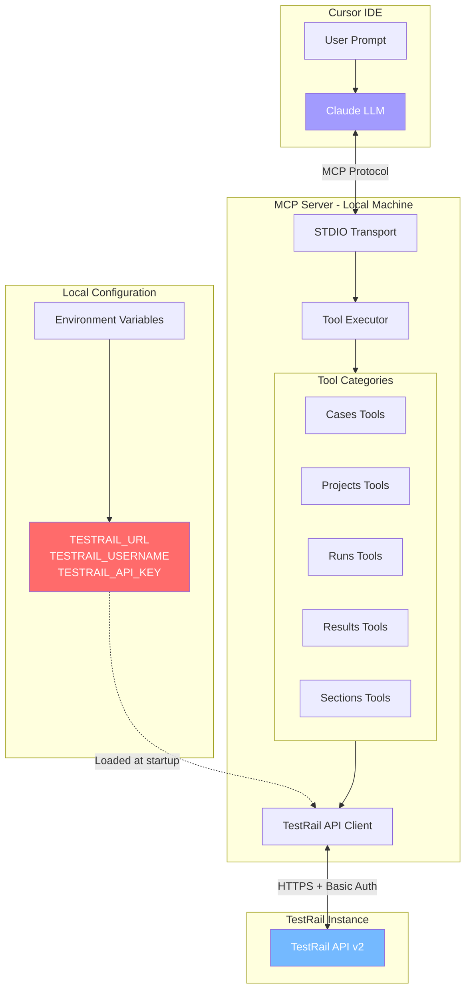
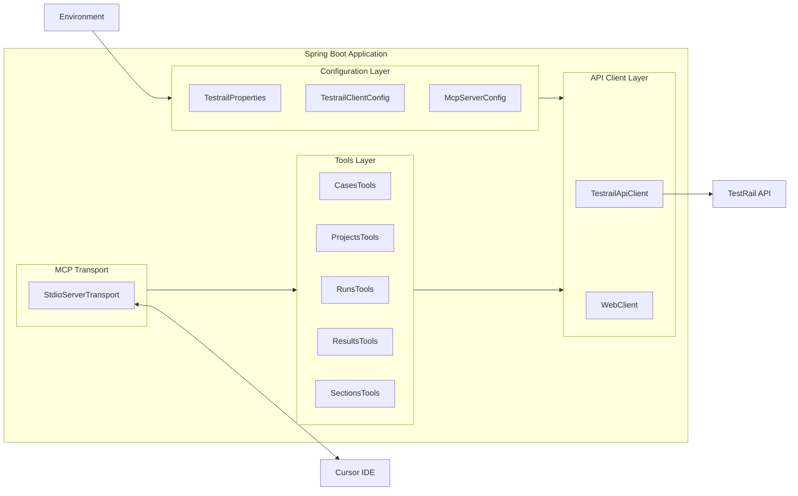
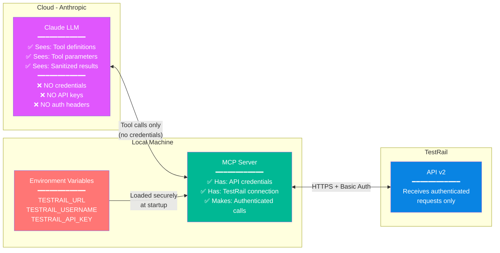
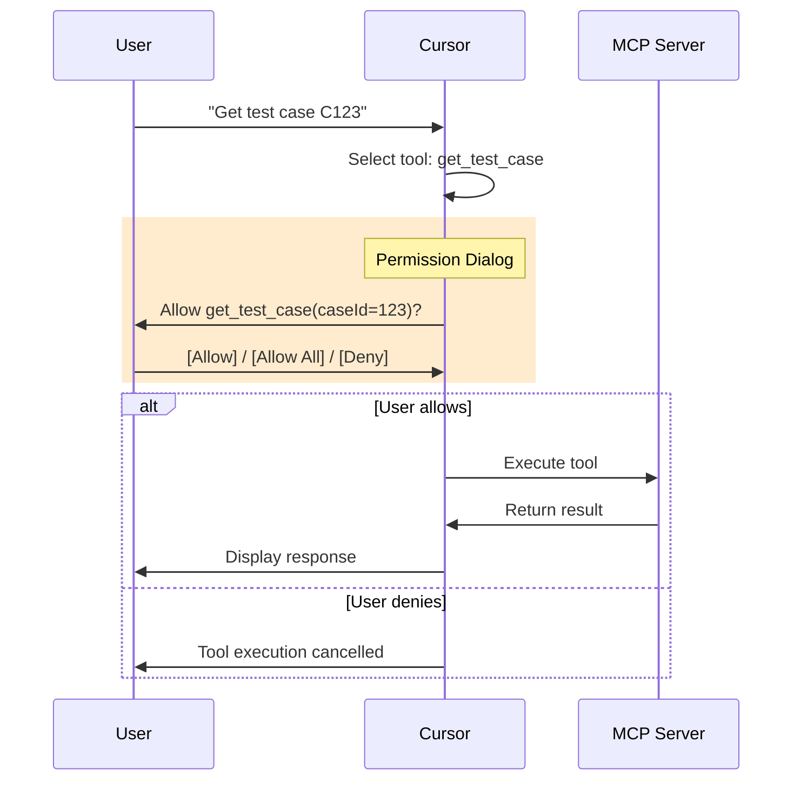
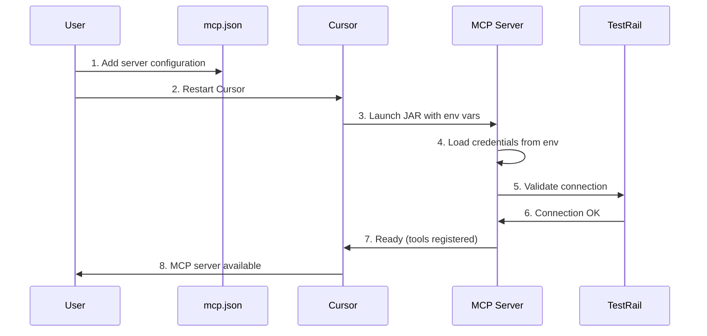
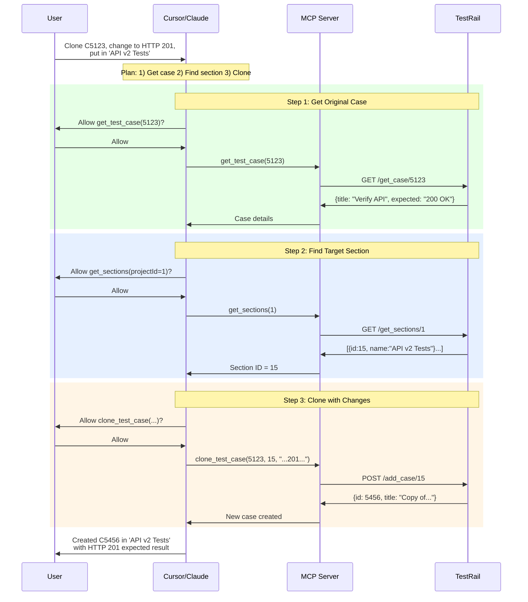
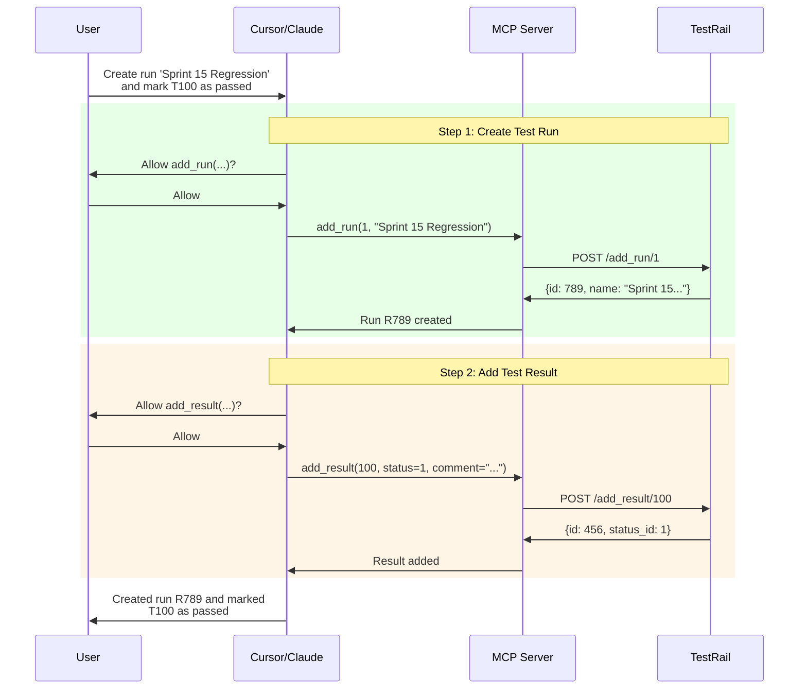
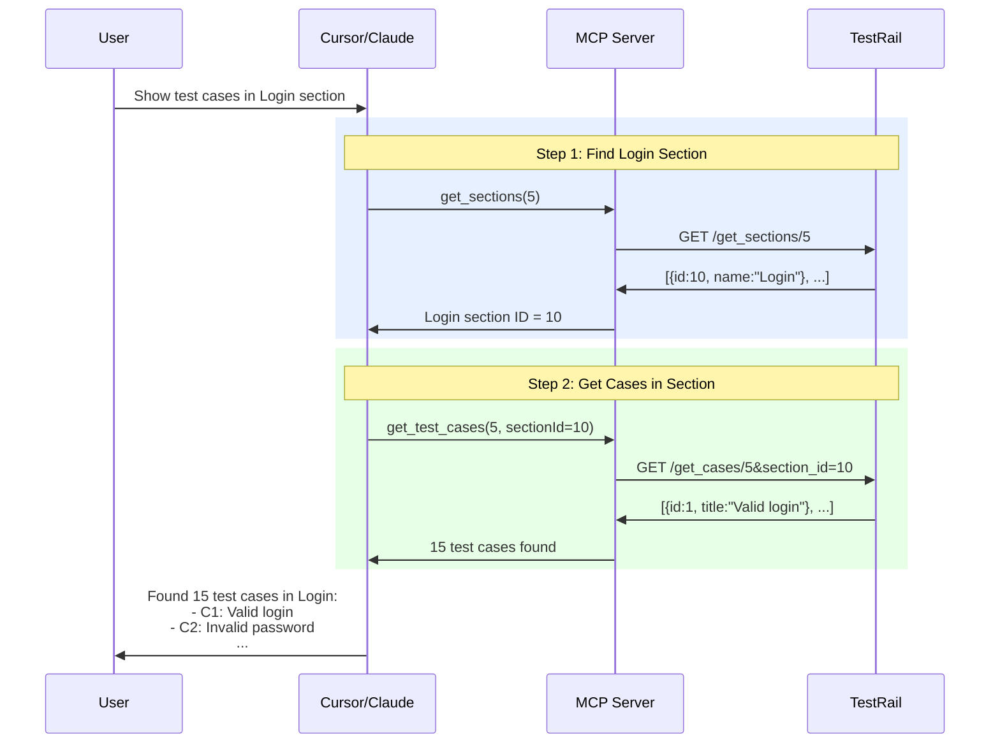
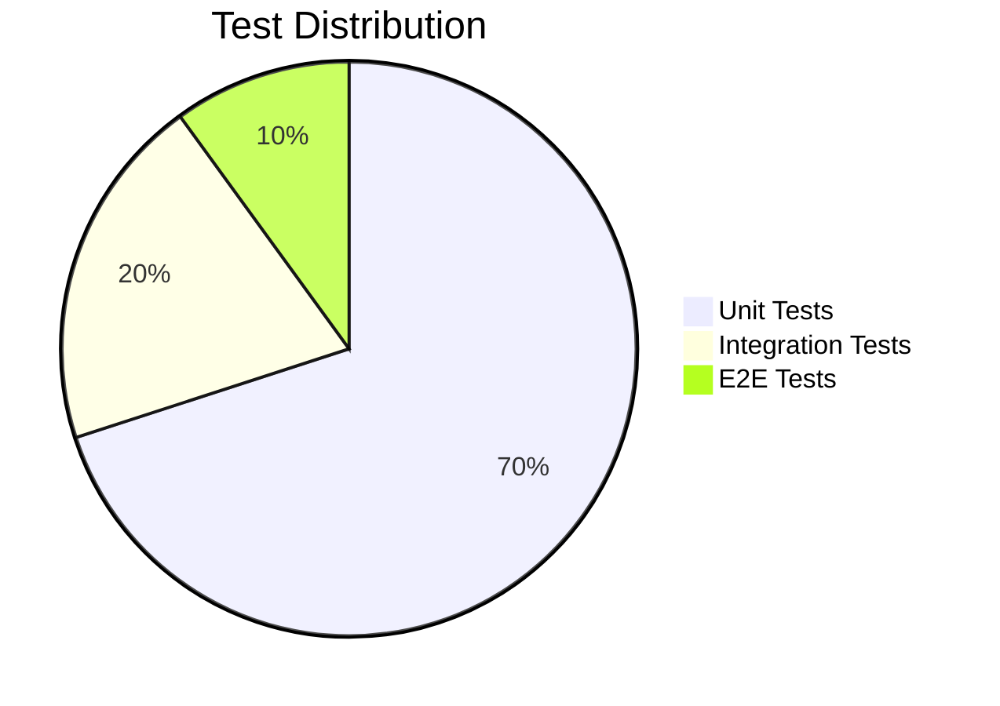

# TestRail MCP Server

A Spring Boot MCP (Model Context Protocol) Server that enables AI assistants like Cursor to interact with TestRail. Built with Java 17 and Spring AI, this server exposes TestRail operations as tools that can be invoked by LLMs while keeping your credentials secure on your local machine.

## Table of Contents

- [Features](#features)
- [Architecture](#architecture)
- [Security](#security)
- [Prerequisites](#prerequisites)
- [Installation](#installation)
- [Configuration](#configuration)
- [Cursor Integration](#cursor-integration)
- [Available Tools](#available-tools)
- [Example Use Cases](#example-use-cases)
- [Development](#development)
- [Testing](#testing)
- [Troubleshooting](#troubleshooting)
- [License](#license)

## Features

- **31 TestRail Tools**: Complete coverage of TestRail API operations for cases, projects, runs, results, and sections
- **Secure by Design**: API credentials never leave your local machine
- **Permission Control**: Cursor asks for confirmation before executing each tool (like bash commands)
- **Rich Tool Metadata**: Enhanced descriptions with `when_to_use`, `might_lead_to`, and `example_prompts` for better LLM understanding
- **Pagination Support**: Explicit `offset` and `limit` parameters for handling large datasets
- **90% Test Coverage**: Comprehensive test suite with JaCoCo enforcement

## Architecture

### High-Level Architecture



### Component Architecture



## Security

### Credential Isolation

Your TestRail credentials **never leave your local machine** and are **never sent to the LLM**. Here's how the security model works:



### What Gets Sent Where

| Data | Sent to LLM? | Stored Locally? | Sent to TestRail? |
|------|--------------|-----------------|-------------------|
| API Credentials | No Never | Yes Environment only | Yes In auth header |
| Tool Definitions | Yes | Yes | No |
| Tool Parameters | Yes | Yes Logged | Yes In API calls |
| TestRail Responses | Yes Sanitized | Yes Logged | N/A |
| User Prompts | Yes | No | No |

### Permission Control

The MCP server integrates with Cursor's permission system. By default, Cursor will ask for confirmation before executing each tool, similar to how it handles bash commands:



You can configure Cursor to:
- **Ask every time**: Default behavior, maximum control
- **Allow all for session**: Click "Allow All" to run without prompts
- **Configure per-tool**: Set trusted tools in Cursor settings

## Prerequisites

- **Java 17** or higher
- **Gradle 8.x** (or use the included wrapper)
- **TestRail instance** with API access enabled
- **TestRail API key** (generate from TestRail: My Settings -> API Keys)
- **Cursor IDE** with MCP support

## Installation

### 1. Clone the Repository

```bash
git clone https://github.com/yourusername/testrail-mcp-server.git
cd testrail-mcp-server
```

### 2. Build the Project

```bash
./gradlew build
```

This will:
- Compile the Java 17 source code
- Run all tests
- Verify 90% code coverage
- Create an executable JAR at `build/libs/testrail-mcp-server.jar`

### 3. Verify the Build

```bash
./gradlew test jacocoTestReport
```

View the coverage report at `build/reports/jacoco/test/html/index.html`

## Configuration

### Environment Variables

Set the following environment variables before running the server:

```bash
# Required
export TESTRAIL_URL="https://yourcompany.testrail.io"
export TESTRAIL_USERNAME="your.email@company.com"
export TESTRAIL_API_KEY="your-api-key-here"

# Optional
export TESTRAIL_LOG_LEVEL="DEBUG"  # DEBUG, INFO, WARN, ERROR
```

### Application Configuration

The server uses `application.yml` for configuration. You can override settings via environment variables:

```yaml
testrail:
  base-url: ${TESTRAIL_URL:https://example.testrail.io}
  username: ${TESTRAIL_USERNAME:}
  api-key: ${TESTRAIL_API_KEY:}

spring:
  main:
    web-application-type: none
  ai:
    mcp:
      server:
        name: testrail-mcp-server
        version: 1.0.0

logging:
  level:
    io.github.testrail.mcp: ${TESTRAIL_LOG_LEVEL:INFO}
```

### Getting Your TestRail API Key

1. Log in to your TestRail instance
2. Click on your name in the top-right corner
3. Select **My Settings**
4. Go to the **API Keys** tab
5. Click **Add Key** and give it a name
6. Copy the generated key (you won't see it again!)

## Cursor Integration

### Step 1: Configure MCP in Cursor

Create or edit your Cursor MCP configuration file:

**macOS/Linux**: `~/.cursor/mcp.json`
**Windows**: `%USERPROFILE%\.cursor\mcp.json`

```json
{
  "mcpServers": {
    "testrail": {
      "command": "java",
      "args": [
        "-jar",
        "/absolute/path/to/testrail-mcp-server.jar"
      ],
      "env": {
        "TESTRAIL_URL": "https://yourcompany.testrail.io",
        "TESTRAIL_USERNAME": "your.email@company.com",
        "TESTRAIL_API_KEY": "your-api-key"
      }
    }
  }
}
```

### Step 2: Restart Cursor

After saving the configuration, restart Cursor to load the MCP server.

### Step 3: Verify Connection

In Cursor, open the command palette (Cmd/Ctrl + Shift + P) and search for "MCP" to verify the server is connected.

### Configuration Flow



## Available Tools

### Test Cases

| Tool | Description | Destructive | Requires Confirmation |
|------|-------------|-------------|----------------------|
| `get_test_case` | Get a test case by ID | No | No |
| `get_test_cases` | List test cases with pagination | No | No |
| `add_test_case` | Create a new test case | No | Yes |
| `update_test_case` | Update an existing test case | No | Yes |
| `delete_test_case` | Delete a test case | **Yes** | Yes |
| `clone_test_case` | Clone a test case with modifications | No | Yes |

### Projects

| Tool | Description | Destructive | Requires Confirmation |
|------|-------------|-------------|----------------------|
| `get_project` | Get project details | No | No |
| `get_projects` | List all projects | No | No |
| `add_project` | Create a new project | No | Yes |
| `update_project` | Update project settings | No | Yes |
| `delete_project` | Delete a project | **Yes** | Yes |

### Test Runs

| Tool | Description | Destructive | Requires Confirmation |
|------|-------------|-------------|----------------------|
| `get_run` | Get test run details | No | No |
| `get_runs` | List test runs with pagination | No | No |
| `add_run` | Create a new test run | No | Yes |
| `update_run` | Update test run settings | No | Yes |
| `close_run` | Close/finalize a test run | No | Yes |
| `delete_run` | Delete a test run | **Yes** | Yes |

### Test Results

| Tool | Description | Destructive | Requires Confirmation |
|------|-------------|-------------|----------------------|
| `get_results` | Get results for a test | No | No |
| `get_results_for_run` | Get all results for a run | No | No |
| `add_result` | Add a test result | No | Yes |
| `add_results` | Add multiple results | No | Yes |
| `add_results_for_cases` | Add results for cases in run | No | Yes |

### Sections

| Tool | Description | Destructive | Requires Confirmation |
|------|-------------|-------------|----------------------|
| `get_section` | Get section details | No | No |
| `get_sections` | List sections with pagination | No | No |
| `add_section` | Create a new section | No | Yes |
| `update_section` | Update section details | No | Yes |
| `delete_section` | Delete a section | **Yes** | Yes |
| `move_section` | Move section to new location | No | Yes |

## Example Use Cases

### Use Case 1: Clone and Modify a Test Case

**User Prompt:**
> "Clone test case C5123 and update the expected result to check for HTTP 201 status instead of 200. Put it in the 'API v2 Tests' section."



### Use Case 2: Create a Test Run and Add Results

**User Prompt:**
> "Create a regression test run for project 1 called 'Sprint 15 Regression' and mark test T100 as passed with comment 'All assertions verified'."



### Use Case 3: Explore Test Coverage

**User Prompt:**
> "Show me all test cases in the Login section of project 5"



## Development

### Project Structure

```
testrail-mcp-server/
├── build.gradle                    # Gradle build configuration
├── settings.gradle                 # Gradle settings
├── README.md                       # This file
│
├── src/main/java/io/github/testrail/mcp/
│   ├── TestrailMcpServerApplication.java
│   │
│   ├── config/
│   │   ├── TestrailProperties.java      # Configuration properties
│   │   └── McpServerConfig.java         # MCP server setup
│   │
│   ├── client/
│   │   ├── TestrailApiClient.java       # TestRail API client
│   │   └── TestrailApiException.java    # Custom exception
│   │
│   ├── model/                           # Domain models
│   │   ├── TestCase.java
│   │   ├── Project.java
│   │   ├── TestRun.java
│   │   ├── TestResult.java
│   │   └── Section.java
│   │
│   └── tools/                           # MCP Tools
│       ├── annotation/
│       │   └── TestrailTool.java        # Custom annotation
│       ├── cases/
│       ├── projects/
│       ├── runs/
│       ├── results/
│       └── sections/
│
├── src/main/resources/
│   └── application.yml
│
└── src/test/java/io/github/testrail/mcp/
    ├── client/
    │   └── TestrailApiClientTest.java
    ├── tools/
    │   └── */*Test.java
    └── integration/
        └── McpServerIntegrationTest.java
```

### Building

```bash
# Build without tests
./gradlew build -x test

# Build with tests
./gradlew build

# Run tests only
./gradlew test

# Generate coverage report
./gradlew jacocoTestReport
```

### Running Locally

```bash
# Set environment variables
export TESTRAIL_URL="https://yourcompany.testrail.io"
export TESTRAIL_USERNAME="your.email@company.com"
export TESTRAIL_API_KEY="your-api-key"

# Run the application
./gradlew bootRun

# Or run the JAR directly
java -jar build/libs/testrail-mcp-server.jar
```

## Testing

### Test Categories



### Running Tests

```bash
# Run all tests
./gradlew test

# Run specific test class
./gradlew test --tests "TestrailApiClientTest"

# Run with coverage
./gradlew test jacocoTestReport

# Verify coverage threshold (90%)
./gradlew jacocoTestCoverageVerification
```

### Coverage Report

After running tests, view the HTML coverage report:

```bash
open build/reports/jacoco/test/html/index.html
```

## Troubleshooting

### Common Issues

#### 1. "Connection refused" error

```
Caused by: java.net.ConnectException: Connection refused
```

**Solution**: Verify your TestRail URL is correct and accessible:
```bash
curl -I https://yourcompany.testrail.io
```

#### 2. "401 Unauthorized" error

```
TestRail API returned HTTP 401: Authentication failed
```

**Solution**:
- Verify your username and API key are correct
- Ensure the API key hasn't expired
- Check that API access is enabled in TestRail (Administration -> Site Settings -> API)

#### 3. MCP server not appearing in Cursor

**Solutions**:
1. Check that `mcp.json` is valid JSON
2. Verify the JAR path is absolute, not relative
3. Restart Cursor completely
4. Check Cursor's developer console for errors

#### 4. "Class not found" or "JAR not found"

**Solution**: Ensure you've built the project:
```bash
./gradlew bootJar
ls -la build/libs/testrail-mcp-server.jar
```

### Debug Mode

Enable debug logging for more details:

```bash
export TESTRAIL_LOG_LEVEL=DEBUG
java -jar build/libs/testrail-mcp-server.jar
```

Or add to your `mcp.json`:

```json
{
  "mcpServers": {
    "testrail": {
      "command": "java",
      "args": ["-jar", "/path/to/testrail-mcp-server.jar"],
      "env": {
        "TESTRAIL_URL": "...",
        "TESTRAIL_USERNAME": "...",
        "TESTRAIL_API_KEY": "...",
        "TESTRAIL_LOG_LEVEL": "DEBUG"
      }
    }
  }
}
```

### Getting Help

1. Check the [Issues](https://github.com/yourusername/testrail-mcp-server/issues) page
2. Enable debug logging and check the output
3. Create a new issue with:
   - Your environment (OS, Java version, Cursor version)
   - Error messages
   - Steps to reproduce

## License

This project is licensed under the MIT License - see the [LICENSE](LICENSE) file for details.

---

## Quick Reference Card

### Environment Variables

| Variable | Required | Description |
|----------|----------|-------------|
| `TESTRAIL_URL` | Yes | Your TestRail instance URL |
| `TESTRAIL_USERNAME` | Yes | Your TestRail email/username |
| `TESTRAIL_API_KEY` | Yes | Your TestRail API key |
| `TESTRAIL_LOG_LEVEL` | No | Logging level (DEBUG/INFO/WARN/ERROR) |

### Status IDs (for add_result)

| ID | Status |
|----|--------|
| 1 | Passed |
| 2 | Blocked |
| 3 | Untested |
| 4 | Retest |
| 5 | Failed |

### Priority IDs (for add_test_case)

| ID | Priority |
|----|----------|
| 1 | Low |
| 2 | Medium |
| 3 | High |
| 4 | Critical |

### Common Example Prompts

```
"Show me test case C123"
"List all test cases in project 5"
"Create a test case for login validation in section 10"
"Clone test case C456 and change the title"
"Create a test run called 'Regression v2.0' for project 1"
"Mark test T789 as passed with comment 'Working as expected'"
"What sections are in project 3?"
"Delete test case C999"
```
