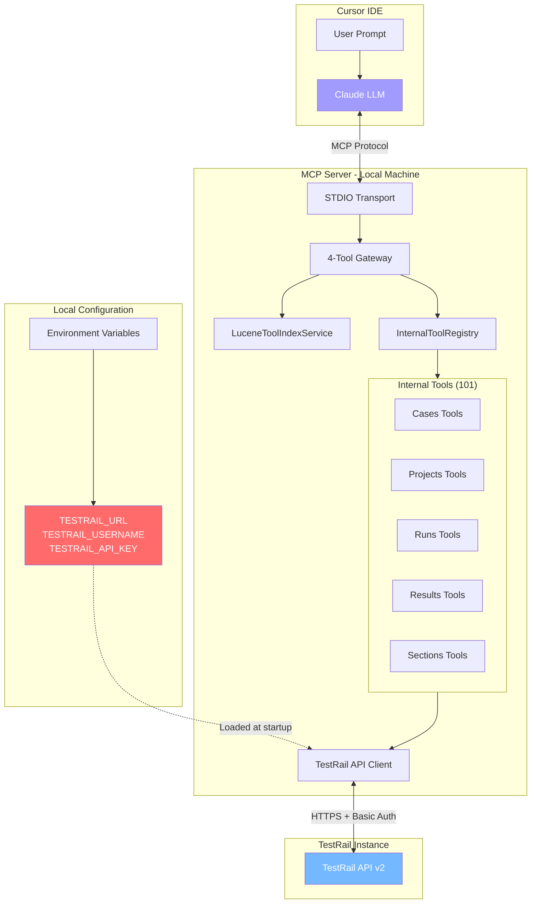
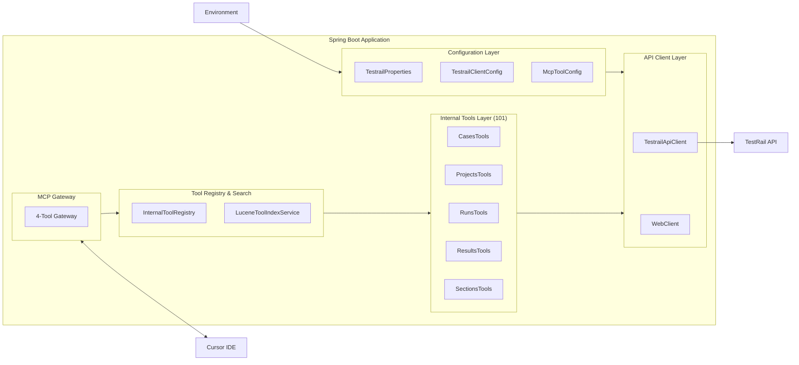

# TestRail MCP Server

A Spring Boot MCP (Model Context Protocol) Server that enables AI assistants like Cursor to interact with TestRail. Built with Java 17 and Spring AI, this server exposes a powerful, searchable toolset for TestRail operations while keeping your credentials secure on your local machine.

## Table of Contents

- [Features](#features)
- [Architecture](#architecture)
- [Security](#security)
- [Prerequisites](#prerequisites)
- [Installation](#installation)
- [Configuration](#configuration)
- [Cursor Integration](#cursor-integration)
- [Available Tools](#available-tools)
- [Example Use Cases](#example-use-cases)
- [Development](#development)
- [Testing](#testing)
- [Troubleshooting](#troubleshooting)
- [Documentation](#documentation)
- [License](#license)

## Documentation

For detailed documentation with comprehensive Mermaid diagrams, see the `docs/` folder:

| Document | Description |
|---|---|
| [Architecture](docs/ARCHITECTURE.md) | Detailed architecture with class diagrams, component diagrams, and data flow |
| [Tools Reference](docs/TOOLS.md) | Complete reference for all 101 internal tools with parameters and examples |
| [Security](docs/SECURITY.md) | Security architecture, threat model, and credential management |
| [Integration Guide](docs/INTEGRATION.md) | Step-by-step Cursor IDE integration and troubleshooting |

## Features

- **101 TestRail Tools**: Complete coverage of TestRail API operations, accessible via a 4-tool gateway.
- **Dual Discovery Paths**: Find tools via natural language search (`search_tools`) or by browsing a structured catalog (`get_categories`, `get_tools_by_category`).
- **Searchable Tools**: A powerful `search_tools` method allows the LLM to find the right tool for the job using natural language.
- **Secure by Design**: API credentials never leave your local machine.
- **Permission Control**: Cursor asks for confirmation before executing each tool.
- **Rich Tool Metadata**: All internal tools are annotated with detailed descriptions, categories, keywords, and examples for optimal LLM understanding.
- **90% Test Coverage**: Comprehensive test suite with JaCoCo enforcement.

## Architecture

### High-Level Architecture



### Component Architecture



## Security

Your TestRail credentials **never leave your local machine** and are **never sent to the LLM**. The architecture is designed to expose only a 4-tool gateway to the LLM, keeping the 101 internal tool implementations and your credentials secure.

## Prerequisites

- **Java 17** or higher
- **Gradle 8.x** (or use the included wrapper)
- **TestRail instance** with API access enabled
- **TestRail API key**
- **Cursor IDE** with MCP support

## Installation

1.  **Clone the Repository**
    ```bash
    git clone https://github.com/yourusername/testrail-mcp-server.git
    cd testrail-mcp-server
    ```

2.  **Build the Project**
    ```bash
    ./gradlew build
    ```

## Configuration

Set the following environment variables before running the server:

```bash
export TESTRAIL_URL="https://yourcompany.testrail.io"
export TESTRAIL_USERNAME="your.email@company.com"
export TESTRAIL_API_KEY="your-api-key-here"
```

## Cursor Integration

Create or edit `~/.cursor/mcp.json`:

```json
{
  "mcpServers": {
    "testrail": {
      "command": "java",
      "args": [
        "-jar",
        "/absolute/path/to/testrail-mcp-server.jar"
      ],
      "env": {
        "TESTRAIL_URL": "https://yourcompany.testrail.io",
        "TESTRAIL_USERNAME": "your.email@company.com",
        "TESTRAIL_API_KEY": "your-api-key"
      }
    }
  }
}
```

## The 4-Tool Gateway

This server exposes a 4-tool gateway to the LLM, providing two discovery paths to the 101 internal tools:

-   **Search Path**
    -   `search_tools(query: string)`: Fuzzy-searches all 101 internal tools and returns a ranked list of matches.
-   **Browse Path**
    -   `get_categories()`: Returns a list of all 19 tool categories (e.g., `test-cases`, `projects`).
    -   `get_tools_by_category(category: string)`: Returns all tools in a specific category.
-   **Execution**
    -   `execute_tool(toolName: string, parameters: map)`: Executes a specific internal tool by name.

## Example Use Cases

### Search-Based Discovery

**User:** "Find all test cases in the 'User Authentication' suite of the 'Mobile App' project."

1.  **LLM calls `search_tools("find test cases in suite")`**
2.  Server returns `get_cases` as a top result, with parameters `projectId`, `suiteId`, etc.
3.  **LLM calls `execute_tool("get_project_by_name", {name: "Mobile App"})`** to get the project ID.
4.  **LLM calls `execute_tool("get_suite_by_name", {projectId: 1, name: "User Authentication"})`** to get the suite ID.
5.  **LLM calls `execute_tool("get_cases", {projectId: 1, suiteId: 5})`** to get the test cases.

### Browse-Based Discovery

**User:** "I need to manage test runs. What can I do?"

1.  **LLM calls `get_categories()`** to see what's available.
2.  Server returns a list of categories, including `test-runs`.
3.  **LLM calls `get_tools_by_category("test-runs")`** to see the tools in that category.
4.  Server returns `get_run`, `get_runs`, `add_run`, `update_run`, `close_run`, `delete_run`.
5.  **LLM calls `execute_tool("get_runs", {projectId: 1})`** to get all test runs for a project.

## Development

The core of the system is the `@InternalTool` annotation, which is used to decorate all 101 internal TestRail tool methods. The `InternalToolRegistry` scans these annotations at startup to build a runtime registry. The `LuceneToolIndexService` then indexes this registry for fast, semantic search.

## Testing

Run the full test suite with coverage verification:

```bash
./gradlew clean build
```

