# Architecture Documentation

This document provides detailed architectural documentation for the TestRail MCP Server.

## Table of Contents

- [System Overview](#system-overview)
- [Component Architecture](#component-architecture)
- [Data Flow](#data-flow)
- [Class Diagrams](#class-diagrams)
- [Package Structure](#package-structure)
- [Technology Stack](#technology-stack)

---

## System Overview

The TestRail MCP Server acts as a bridge between AI assistants (like Cursor) and TestRail, enabling natural language interactions with test management operations.

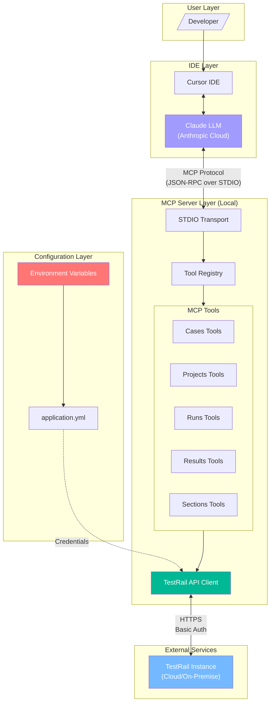

---

## Component Architecture

### Layer Diagram

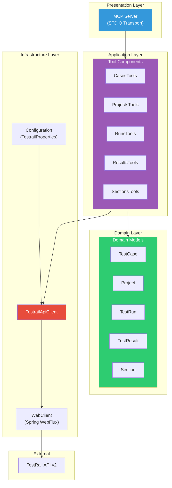

### Component Interaction

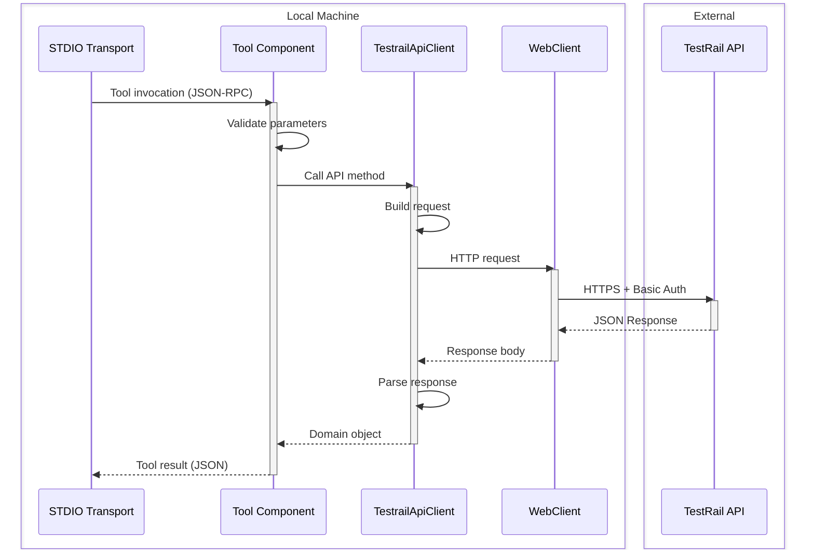

---

## Data Flow

### Request Flow

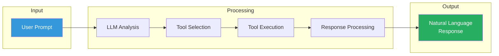

### Tool Execution Flow

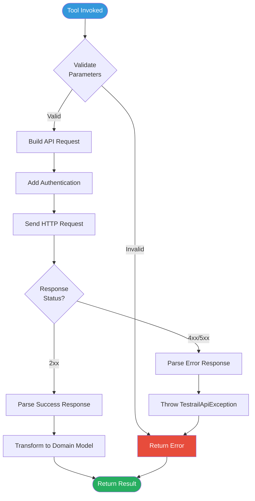

### Authentication Flow

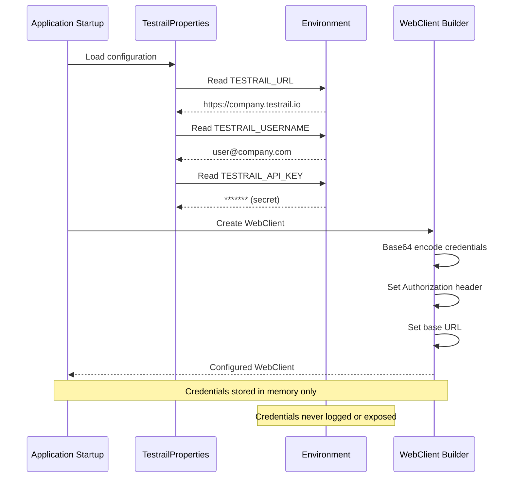

---

## Class Diagrams

### Core Classes

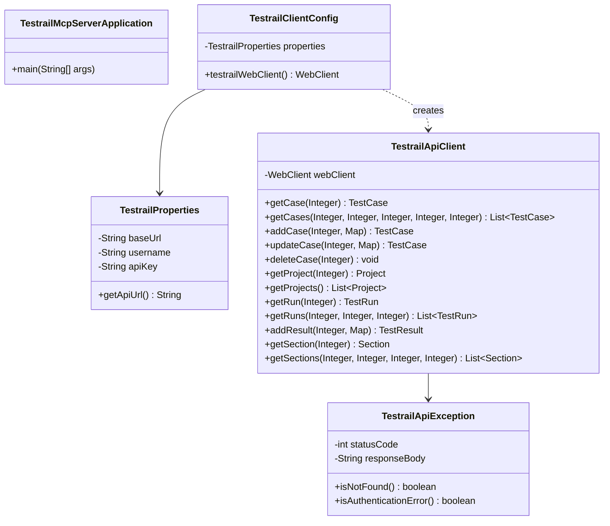

### Domain Models

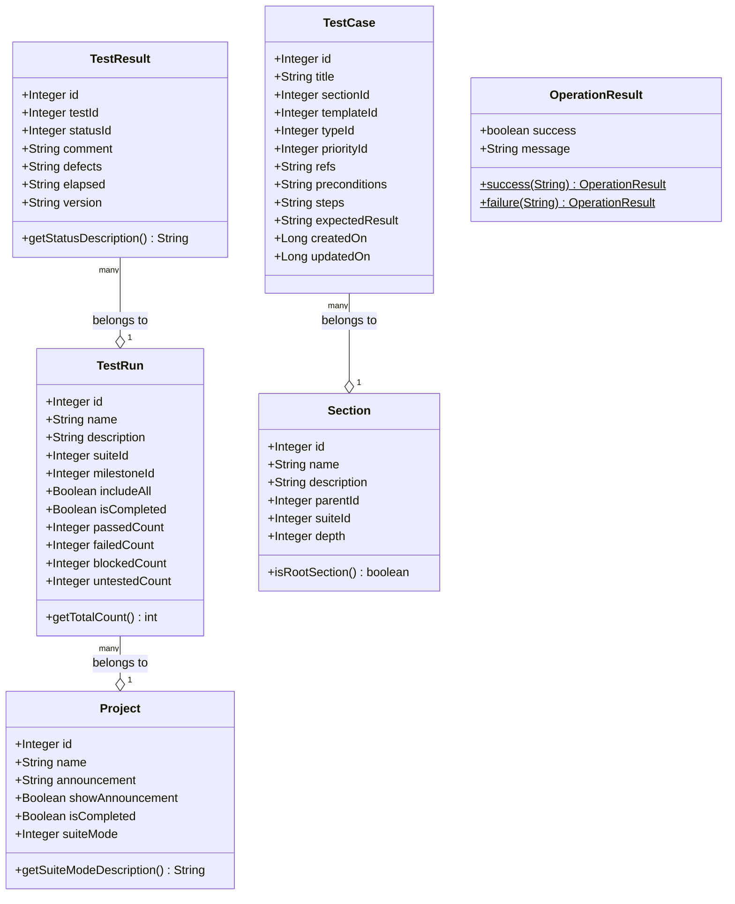

### Tool Classes

```mermaid
classDiagram
    class CasesTools {
        -TestrailApiClient apiClient
        +getTestCase(Integer) TestCase
        +getTestCases(Integer, Integer, Integer, Integer, Integer) List~TestCase~
        +addTestCase(Integer, String, String, String, String, Integer, Integer, String) TestCase
        +updateTestCase(Integer, String, String, String, String, Integer, Integer, String) TestCase
        +deleteTestCase(Integer) OperationResult
        +cloneTestCase(Integer, Integer, String, String, String) TestCase
    }

    class ProjectsTools {
        -TestrailApiClient apiClient
        +getProject(Integer) Project
        +getProjects() List~Project~
        +addProject(String, String, Boolean, Integer) Project
        +updateProject(Integer, String, String, Boolean, Boolean) Project
        +deleteProject(Integer) OperationResult
    }

    class RunsTools {
        -TestrailApiClient apiClient
        +getRun(Integer) TestRun
        +getRuns(Integer, Integer, Integer) List~TestRun~
        +addRun(Integer, String, String, Integer, Integer, Integer, Boolean, String) TestRun
        +updateRun(Integer, String, String, Integer, Integer) TestRun
        +closeRun(Integer) TestRun
        +deleteRun(Integer) OperationResult
    }

    class ResultsTools {
        -TestrailApiClient apiClient
        +getResults(Integer, Integer, Integer) List~TestResult~
        +getResultsForRun(Integer, Integer, Integer) List~TestResult~
        +addResult(Integer, Integer, String, String, String, String) TestResult
        +addResults(Integer, String, Integer, String) List~TestResult~
        +addResultsForCases(Integer, String, Integer, String) List~TestResult~
    }

    class SectionsTools {
        -TestrailApiClient apiClient
        +getSection(Integer) Section
        +getSections(Integer, Integer, Integer, Integer) List~Section~
        +addSection(Integer, String, String, Integer, Integer) Section
        +updateSection(Integer, String, String) Section
        +deleteSection(Integer, Boolean) OperationResult
        +moveSection(Integer, Integer, Integer) Section
    }

    class TestrailApiClient {
        <<interface>>
    }

    CasesTools --> TestrailApiClient
    ProjectsTools --> TestrailApiClient
    RunsTools --> TestrailApiClient
    ResultsTools --> TestrailApiClient
    SectionsTools --> TestrailApiClient
```

---

## Package Structure

```mermaid
flowchart TD
    subgraph root["io.github.testrail.mcp"]
        App["TestrailMcpServerApplication"]

        subgraph config["config"]
            Props["TestrailProperties"]
            ClientConfig["TestrailClientConfig"]
        end

        subgraph client["client"]
            ApiClient["TestrailApiClient"]
            ApiException["TestrailApiException"]
        end

        subgraph model["model"]
            TC["TestCase"]
            Proj["Project"]
            Run["TestRun"]
            Result["TestResult"]
            Sec["Section"]
            Op["OperationResult"]
            Page["PaginatedResponse"]
            Step["TestStep"]
        end

        subgraph tools["tools"]
            subgraph annotation["annotation"]
                Cat["ToolCategory"]
            end
            subgraph cases["cases"]
                CTools["CasesTools"]
            end
            subgraph projects["projects"]
                PTools["ProjectsTools"]
            end
            subgraph runs["runs"]
                RTools["RunsTools"]
            end
            subgraph results["results"]
                ResTools["ResultsTools"]
            end
            subgraph sections["sections"]
                STools["SectionsTools"]
            end
        end
    end

    App --> config
    App --> tools
    tools --> client
    tools --> model
    client --> model

    style App fill:#3498db,color:#fff
    style config fill:#e74c3c,color:#fff
    style client fill:#9b59b6,color:#fff
    style model fill:#27ae60,color:#fff
    style tools fill:#f39c12,color:#fff
```

---

## Technology Stack

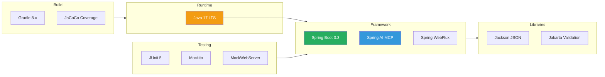

### Dependency Graph

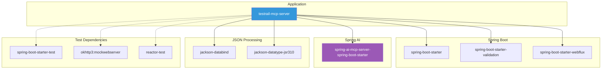
