# Architecture Documentation

This document provides a detailed overview of the TestRail MCP Server's architecture, including component diagrams, data flow, and the tool discovery mechanism.

## Table of Contents

- [System Overview](#system-overview)
- [Component Architecture](#component-architecture)
- [Data Flow](#data-flow)
- [Class Diagrams](#class-diagrams)
- [Package Structure](#package-structure)
- [Technology Stack](#technology-stack)

---

## System Overview

The TestRail MCP Server acts as a bridge between AI assistants (like Cursor) and TestRail, enabling natural language interactions with test management operations.

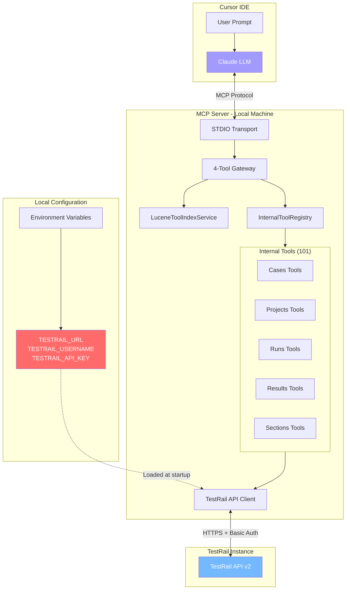

---

## Tool Discovery and Execution

The server does **not** expose all 101 internal tools directly to the MCP client. Doing so would consume a massive number of tokens in the LLM's context window, making it inefficient and expensive. Instead, it exposes a **4-tool gateway** that provides two distinct paths for discovering the internal tools:

1.  **Search Path**: A natural language, fuzzy-search endpoint (`search_tools`).
2.  **Browse Path**: A structured, categorical browsing endpoint (`get_categories` and `get_tools_by_category`).

Once a tool is discovered, the `execute_tool` endpoint is used to run it.

```mermaid
flowchart TD
    subgraph Client["MCP Client (LLM)"]
        direction LR
        Start((Start))
        Search[search_tools(query)]
        BrowseCat[get_categories()]
        BrowseTools[get_tools_by_category(category)]
    end

    subgraph Server["MCP Server"]
        direction TB
        subgraph Gateway["4-Tool Gateway"]
            G_Search[search_tools]
            G_BrowseCat[get_categories]
            G_BrowseTools[get_tools_by_category]
            G_Execute[execute_tool]
        end
        subgraph Discovery["Discovery Services"]
            Lucene[LuceneToolIndexService]
            Registry[InternalToolRegistry]
        end
        subgraph InternalTools["Internal Tools (101)"]
            GetCase[get_case]
            AddRun[add_run]
            UpdateProject[update_project]
        end
    end

    Start --> Search
    Start --> BrowseCat
    
    Search --> G_Search
    BrowseCat --> G_BrowseCat
    BrowseTools --> G_BrowseTools

    G_Search --> Lucene
    G_BrowseCat --> Registry
    G_BrowseTools --> Registry
    
    subgraph Results
        direction TB
        ToolList[Tool List + Details]
    end

    Lucene --> ToolList
    Registry --> ToolList

    subgraph Execution
        Execute[execute_tool(toolName, params)] --> G_Execute
        G_Execute -- Invokes by name via reflection --> InternalTools
    end

    ToolList --> Execute

    style Gateway fill:#a29bfe,color:#fff
    style Discovery fill:#74b9ff,color:#fff
    style InternalTools fill:#55efc4,color:#fff
```

---

## Component Architecture

### Layer Diagram

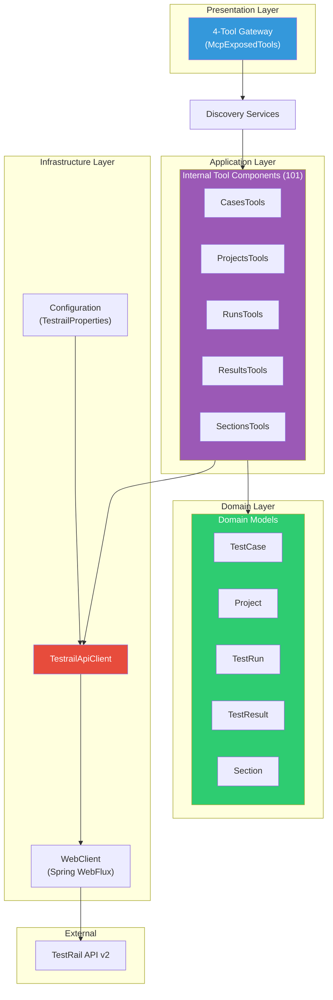

### Component Interaction

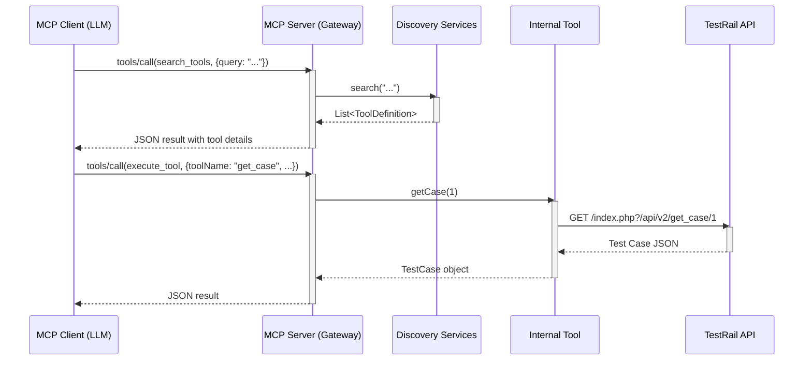

---

## Data Flow

### Request Flow

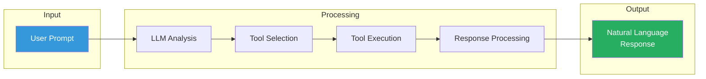

### Tool Execution Flow


### Authentication Flow

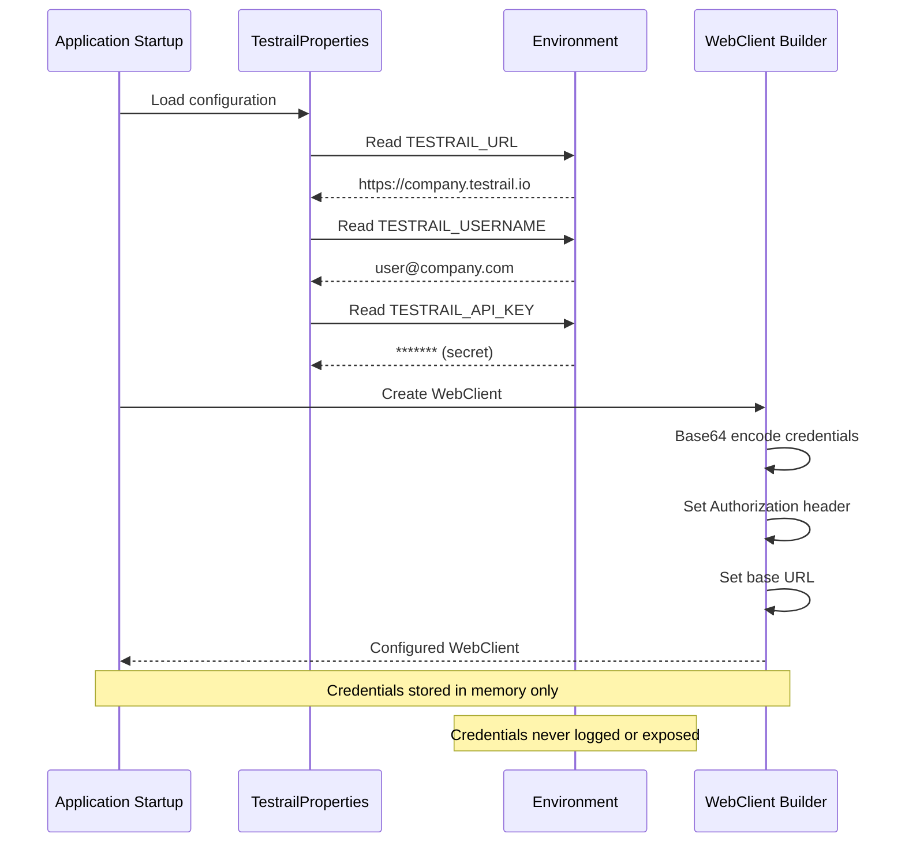

---

## Class Diagrams

### Core Classes

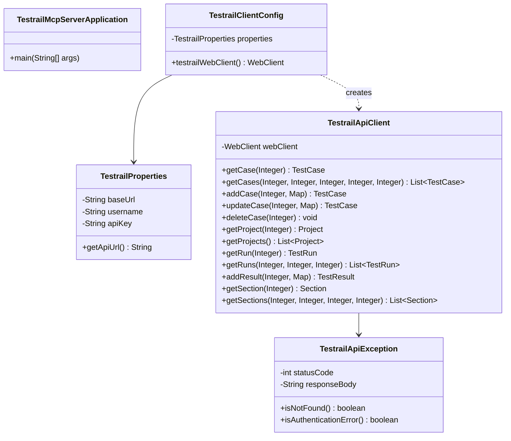

### Domain Models

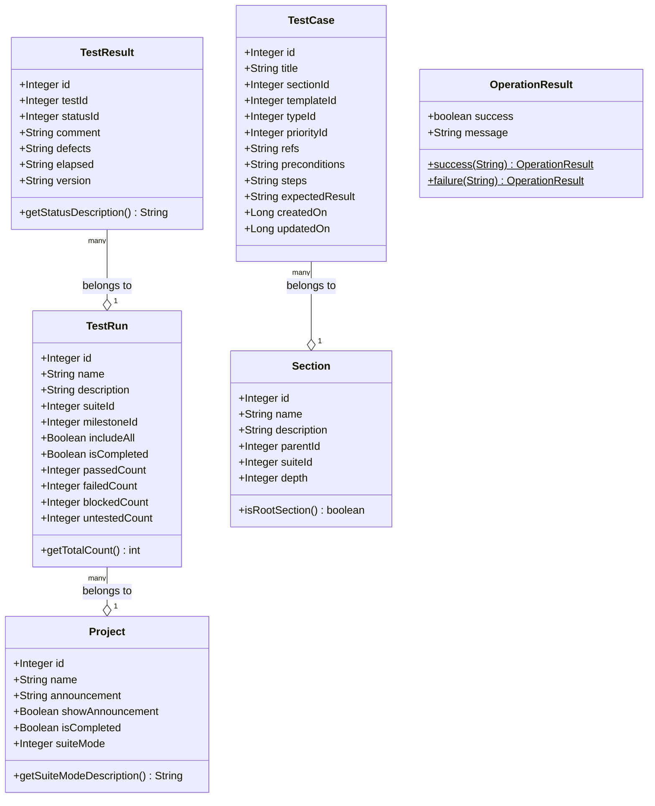

### Tool Classes

```mermaid
classDiagram
    class McpExposedTools {
        +search_tools(String): String
        +get_categories(): String
        +get_tools_by_category(String): String
        +execute_tool(String, String): String
    }

    class CasesTools {
        -TestrailApiClient apiClient
        +getTestCase(Integer) TestCase
        +getTestCases(Integer, Integer, Integer, Integer, Integer) List~TestCase~
        +addTestCase(Integer, String, String, String, String, Integer, Integer, String) TestCase
        +updateTestCase(Integer, String, String, String, String, Integer, Integer, String) TestCase
        +deleteTestCase(Integer) OperationResult
        +cloneTestCase(Integer, Integer, String, String, String) TestCase
    }

    class ProjectsTools {
        -TestrailApiClient apiClient
        +getProject(Integer) Project
        +getProjects() List~Project~
        +addProject(String, String, Boolean, Integer) Project
        +updateProject(Integer, String, String, Boolean, Boolean) Project
        +deleteProject(Integer) OperationResult
    }

    class RunsTools {
        -TestrailApiClient apiClient
        +getRun(Integer) TestRun
        +getRuns(Integer, Integer, Integer) List~TestRun~
        +addRun(Integer, String, String, Integer, Integer, Integer, Boolean, String) TestRun
        +updateRun(Integer, String, String, Integer, Integer) TestRun
        +closeRun(Integer) TestRun
        +deleteRun(Integer) OperationResult
    }

    class ResultsTools {
        -TestrailApiClient apiClient
        +getResults(Integer, Integer, Integer) List~TestResult~
        +getResultsForRun(Integer, Integer, Integer) List~TestResult~
        +addResult(Integer, Integer, String, String, String, String) TestResult
        +addResults(Integer, String, Integer, String) List~TestResult~
        +addResultsForCases(Integer, String, Integer, String) List~TestResult~
    }

    class SectionsTools {
        -TestrailApiClient apiClient
        +getSection(Integer) Section
        +getSections(Integer, Integer, Integer, Integer) List~Section~
        +addSection(Integer, String, String, Integer, Integer) Section
        +updateSection(Integer, String, String) Section
        +deleteSection(Integer, Boolean) OperationResult
        +moveSection(Integer, Integer, Integer) Section
    }

    class TestrailApiClient {
        <<interface>>
    }

    CasesTools --> TestrailApiClient
    ProjectsTools --> TestrailApiClient
    RunsTools --> TestrailApiClient
    ResultsTools --> TestrailApiClient
    SectionsTools --> TestrailApiClient
```

---

## Package Structure

```mermaid
flowchart TD
    subgraph root["io.github.testrail.mcp"]
        App["TestrailMcpServerApplication"]

        subgraph config["config"]
            Props["TestrailProperties"]
            ClientConfig["TestrailClientConfig"]
        end

        subgraph client["client"]
            ApiClient["TestrailApiClient"]
            ApiException["TestrailApiException"]
        end

        subgraph model["model"]
            TC["TestCase"]
            Proj["Project"]
            Run["TestRun"]
            Result["TestResult"]
            Sec["Section"]
            Op["OperationResult"]
            Page["PaginatedResponse"]
            Step["TestStep"]
        end

        subgraph tools["tools"]
            subgraph annotation["annotation"]
                Cat["ToolCategory"]
            end
            subgraph cases["cases"]
                CTools["CasesTools"]
            end
            subgraph projects["projects"]
                PTools["ProjectsTools"]
            end
            subgraph runs["runs"]
                RTools["RunsTools"]
            end
            subgraph results["results"]
                ResTools["ResultsTools"]
            end
            subgraph sections["sections"]
                STools["SectionsTools"]
            end
        end
    end

    App --> config
    App --> tools
    tools --> client
    tools --> model
    client --> model

    style App fill:#3498db,color:#fff
    style config fill:#e74c3c,color:#fff
    style client fill:#9b59b6,color:#fff
    style model fill:#27ae60,color:#fff
    style tools fill:#f39c12,color:#fff
```

---

## Technology Stack

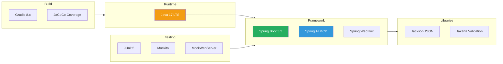

### Dependency Graph

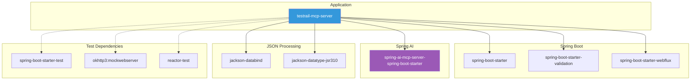
