# Integration Guide

This document provides comprehensive guidance for integrating the TestRail MCP Server with Cursor IDE and other MCP-compatible clients.

## Table of Contents

- [Prerequisites](#prerequisites)
- [Installation](#installation)
- [Configuration](#configuration)
- [Cursor IDE Setup](#cursor-ide-setup)
- [Verification](#verification)
- [Troubleshooting](#troubleshooting)
- [Advanced Configuration](#advanced-configuration)

---

## Prerequisites

### System Requirements

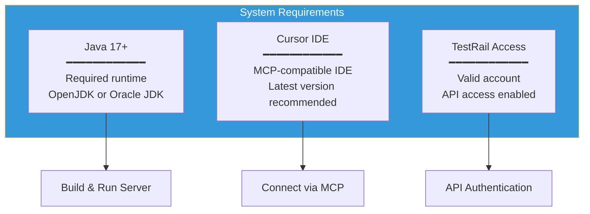

### Checklist

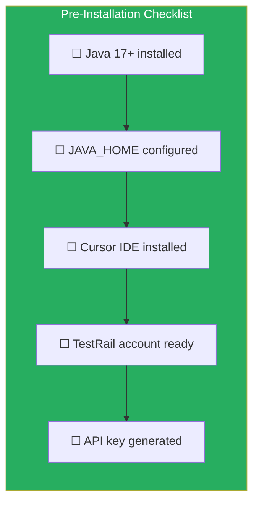

---

## Installation

### Build Process

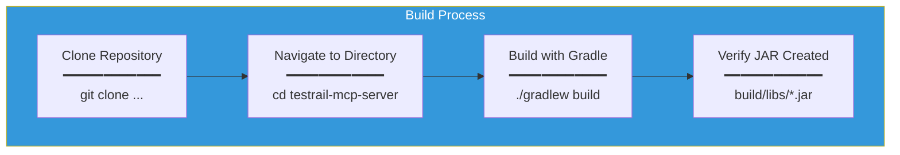

### Build Commands

```bash
# Clone the repository
git clone https://github.com/your-org/testrail-mcp-server.git
cd testrail-mcp-server

# Build the project
./gradlew build

# Run tests with coverage
./gradlew test jacocoTestReport

# Build without tests (faster)
./gradlew build -x test
```

### Build Output Structure

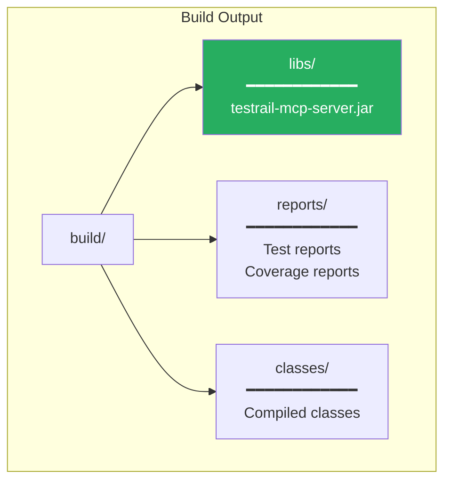

---

## Configuration

### Environment Variables

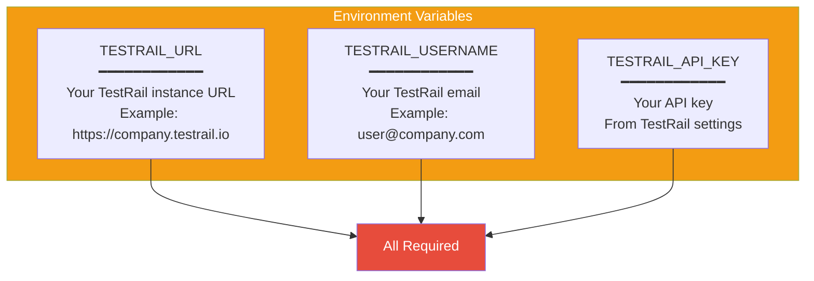

### Setting Environment Variables

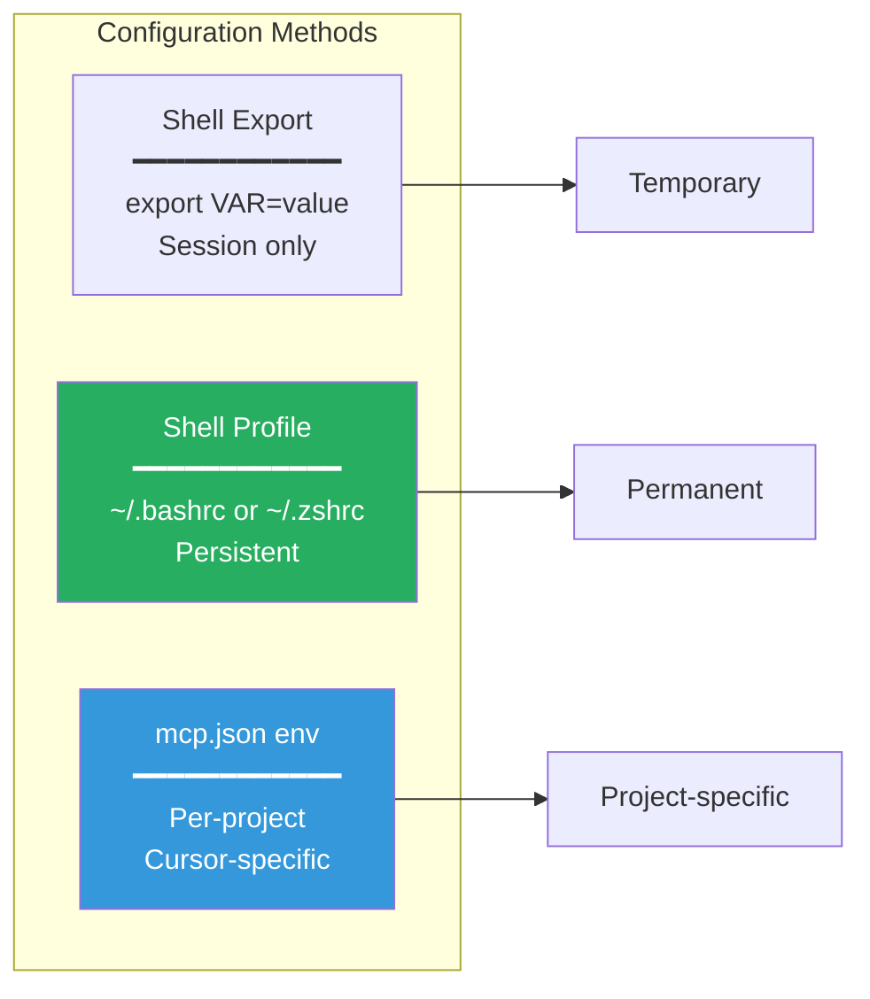

#### Option 1: Shell Profile (Recommended)

```bash
# Add to ~/.bashrc or ~/.zshrc
export TESTRAIL_URL="https://your-company.testrail.io"
export TESTRAIL_USERNAME="your.email@company.com"
export TESTRAIL_API_KEY="your-api-key-here"

# Reload profile
source ~/.bashrc  # or source ~/.zshrc
```

#### Option 2: mcp.json env Section

```json
{
  "mcpServers": {
    "testrail": {
      "command": "java",
      "args": ["-jar", "/path/to/testrail-mcp-server.jar"],
      "env": {
        "TESTRAIL_URL": "https://your-company.testrail.io",
        "TESTRAIL_USERNAME": "your.email@company.com",
        "TESTRAIL_API_KEY": "your-api-key-here"
      }
    }
  }
}
```

---

## Cursor IDE Setup

### Configuration Flow

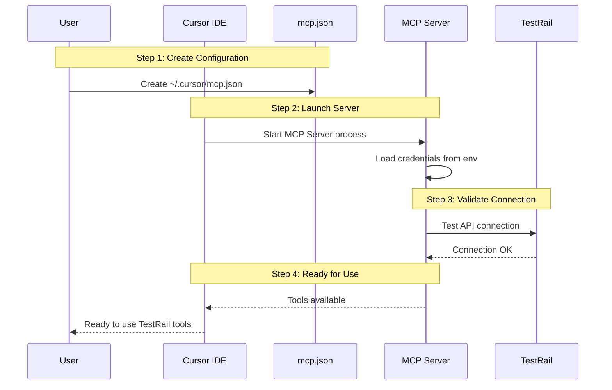

### mcp.json Location

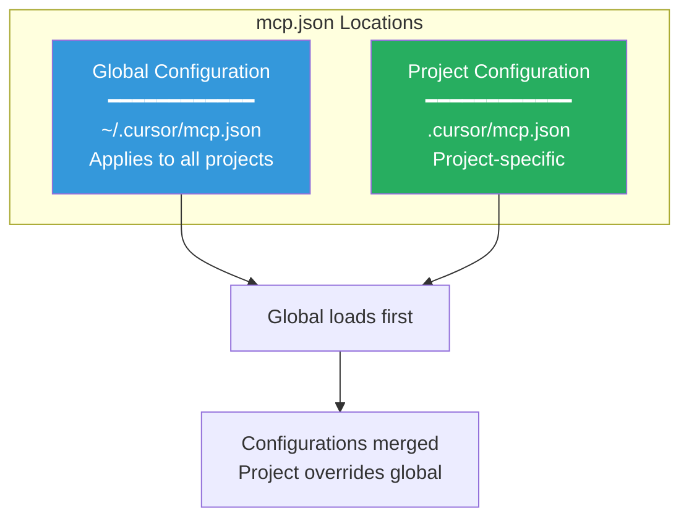

### Complete mcp.json Example

```json
{
  "mcpServers": {
    "testrail": {
      "command": "java",
      "args": [
        "-jar",
        "/absolute/path/to/testrail-mcp-server.jar"
      ],
      "env": {
        "TESTRAIL_URL": "https://your-company.testrail.io",
        "TESTRAIL_USERNAME": "your.email@company.com",
        "TESTRAIL_API_KEY": "your-api-key-here"
      }
    }
  }
}
```

> **Note:** The server automatically manages its lifecycle and shuts down gracefully when Cursor disconnects, preventing orphaned Java processes.

### Step-by-Step Setup

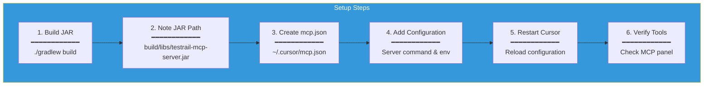

---

## Verification

### Verification Process

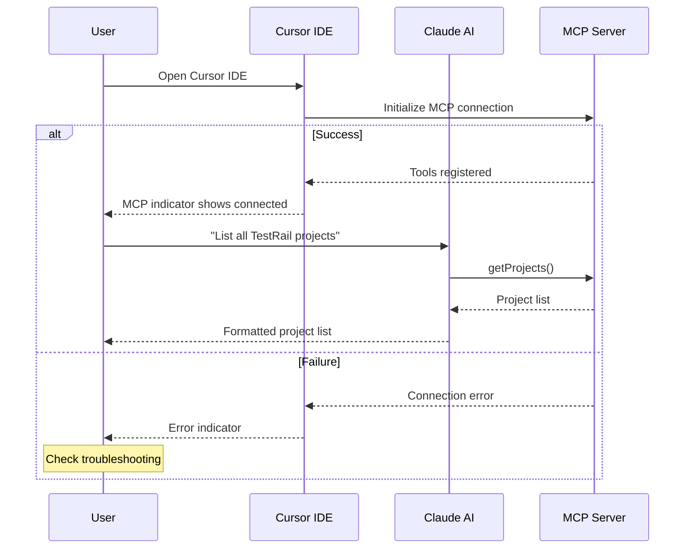

### Testing the Connection

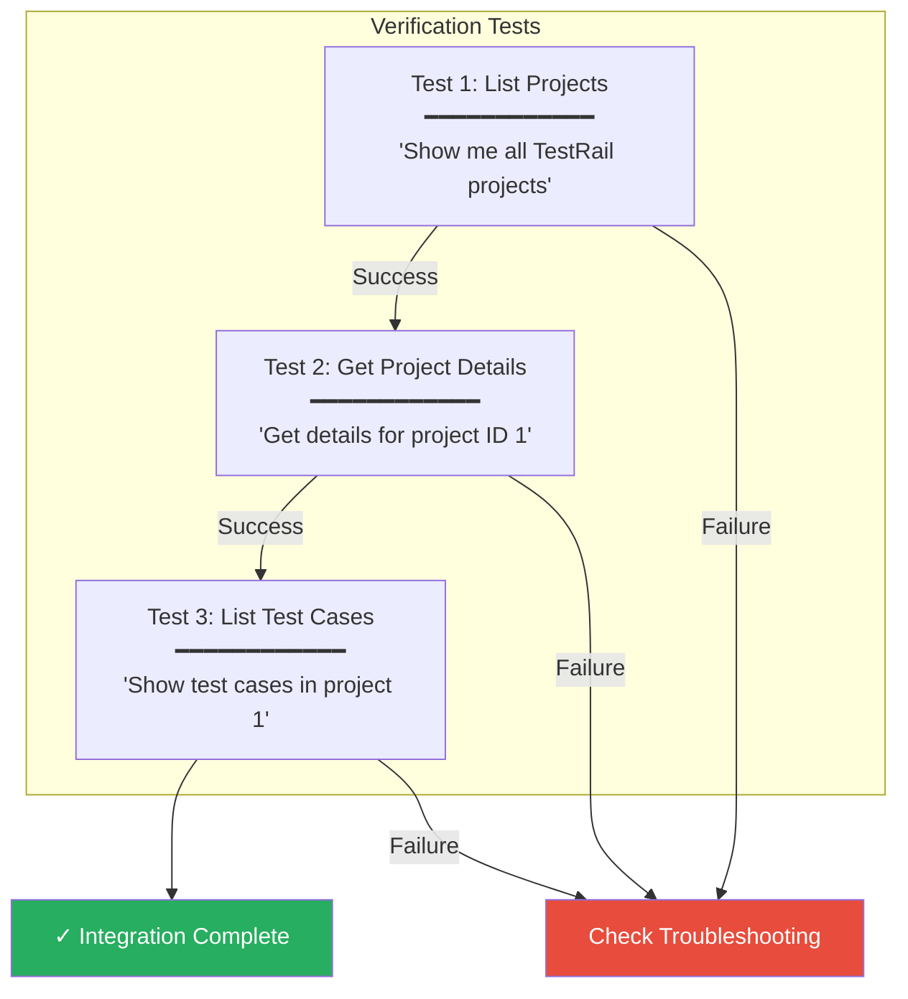

### Sample Verification Commands

Try these prompts in Cursor to verify the integration:

1. **Basic connectivity:**
   > "List all TestRail projects"

2. **Read operations:**
   > "Show me the test cases in project 1, section 2"

3. **Detailed view:**
   > "Get the details of test case C123"

---

## Troubleshooting

### Common Issues

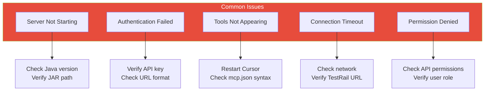

### Diagnostic Flow

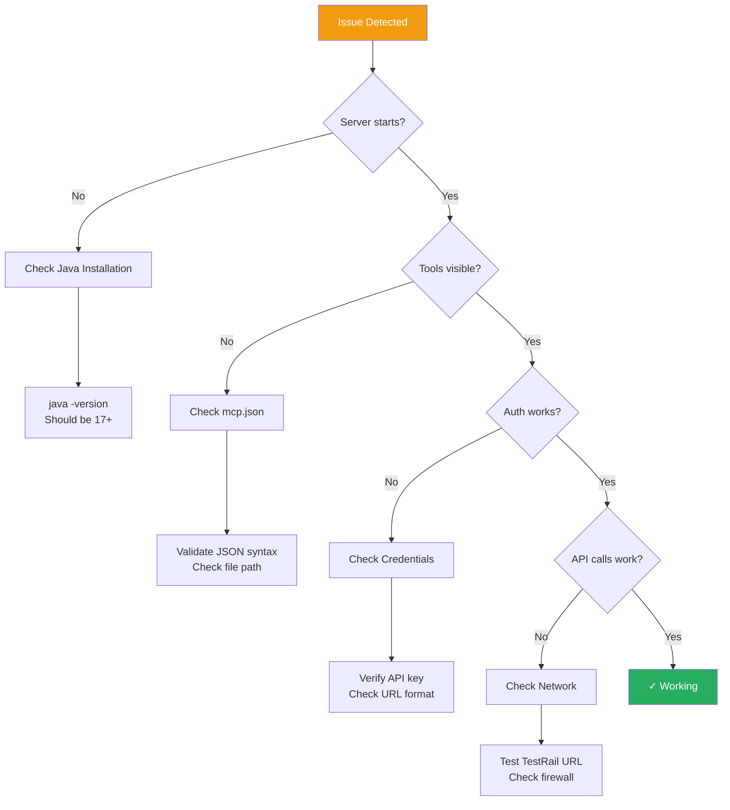

### Error Messages and Solutions

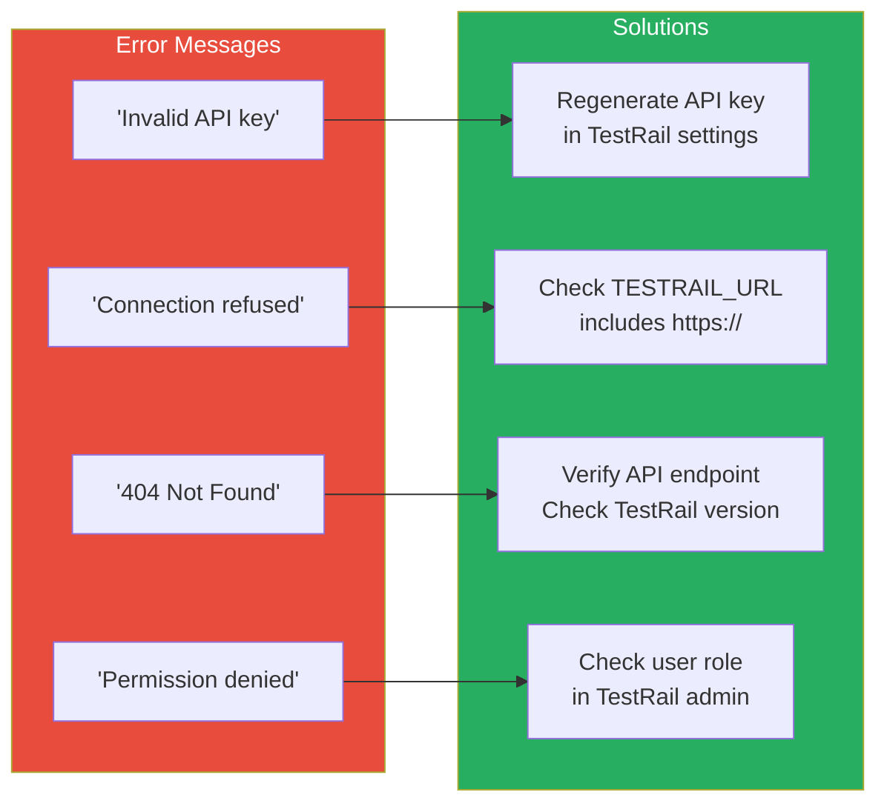

### Debug Logging

Enable debug logging for troubleshooting:

```yaml
# Add to application.yml or via environment
logging:
  level:
    io.github.testrail.mcp: DEBUG
```

Or set via environment:

```bash
export LOGGING_LEVEL_IO_GITHUB_TESTRAIL_MCP=DEBUG
```

---

## Advanced Configuration

### Custom Application Properties

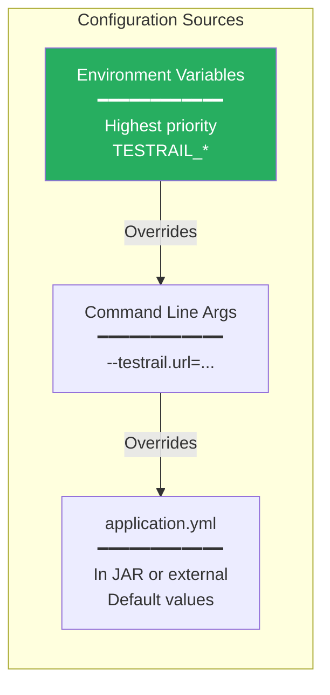

### Multiple TestRail Instances

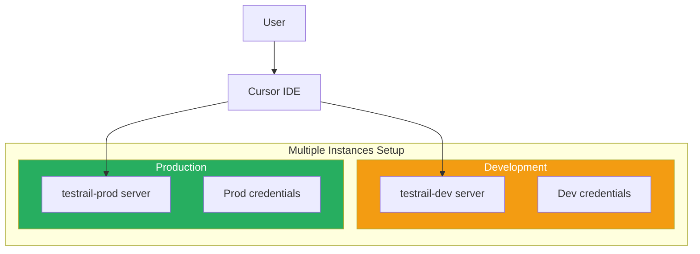

#### mcp.json for Multiple Instances

```json
{
  "mcpServers": {
    "testrail-dev": {
      "command": "java",
      "args": ["-jar", "/path/to/testrail-mcp-server.jar"],
      "env": {
        "TESTRAIL_URL": "https://dev.testrail.io",
        "TESTRAIL_USERNAME": "dev@company.com",
        "TESTRAIL_API_KEY": "dev-api-key"
      }
    },
    "testrail-prod": {
      "command": "java",
      "args": ["-jar", "/path/to/testrail-mcp-server.jar"],
      "env": {
        "TESTRAIL_URL": "https://prod.testrail.io",
        "TESTRAIL_USERNAME": "prod@company.com",
        "TESTRAIL_API_KEY": "prod-api-key"
      }
    }
  }
}
```

### JVM Configuration

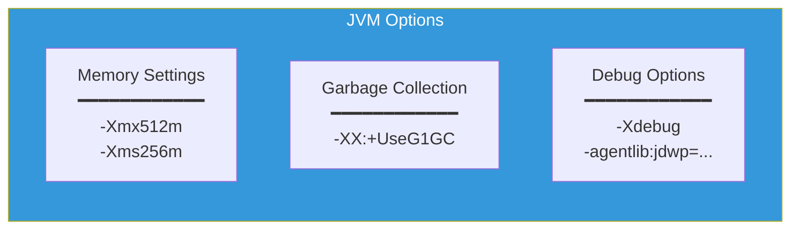

#### Example with JVM Options

```json
{
  "mcpServers": {
    "testrail": {
      "command": "java",
      "args": [
        "-Xmx512m",
        "-Xms256m",
        "-XX:+UseG1GC",
        "-jar",
        "/path/to/testrail-mcp-server.jar"
      ],
      "env": {
        "TESTRAIL_URL": "https://your-company.testrail.io",
        "TESTRAIL_USERNAME": "user@company.com",
        "TESTRAIL_API_KEY": "your-api-key"
      }
    }
  }
}
```

### Proxy Configuration

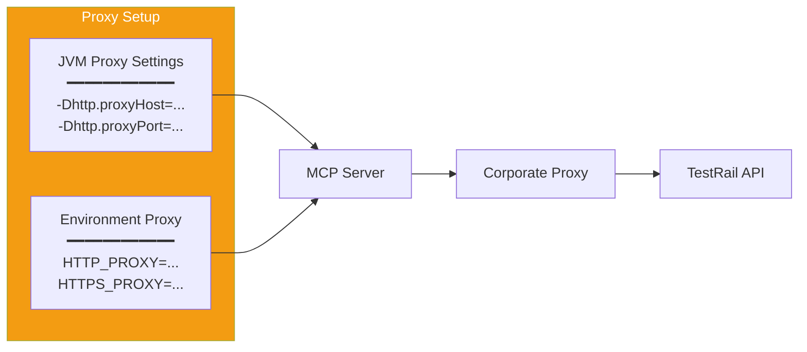

#### Proxy Configuration Example

```json
{
  "mcpServers": {
    "testrail": {
      "command": "java",
      "args": [
        "-Dhttp.proxyHost=proxy.company.com",
        "-Dhttp.proxyPort=8080",
        "-Dhttps.proxyHost=proxy.company.com",
        "-Dhttps.proxyPort=8080",
        "-jar",
        "/path/to/testrail-mcp-server.jar"
      ],
      "env": {
        "TESTRAIL_URL": "https://your-company.testrail.io",
        "TESTRAIL_USERNAME": "user@company.com",
        "TESTRAIL_API_KEY": "your-api-key"
      }
    }
  }
}
```

---

## Quick Reference

### Essential Commands

| Task | Command |
|------|---------|
| Build | `./gradlew build` |
| Test | `./gradlew test` |
| Coverage Report | `./gradlew jacocoTestReport` |
| Clean Build | `./gradlew clean build` |

### Required Environment Variables

| Variable | Description | Example |
|----------|-------------|---------|
| `TESTRAIL_URL` | TestRail instance URL | `https://company.testrail.io` |
| `TESTRAIL_USERNAME` | Login email | `user@company.com` |
| `TESTRAIL_API_KEY` | API key from settings | `abc123...` |

### File Locations

| File | Location | Purpose |
|------|----------|---------|
| Global mcp.json | `~/.cursor/mcp.json` | All projects |
| Project mcp.json | `.cursor/mcp.json` | This project only |
| Built JAR | `build/libs/testrail-mcp-server.jar` | Server executable |

