# Security Documentation

This document details the security architecture of the TestRail MCP Server, explaining how credentials are protected and why this approach is secure.

## Table of Contents

- [Security Overview](#security-overview)
- [Credential Management](#credential-management)
- [Data Flow Security](#data-flow-security)
- [Permission Model](#permission-model)
- [Threat Model](#threat-model)
- [Best Practices](#best-practices)
- [Compliance Considerations](#compliance-considerations)

---

## Security Overview

### Core Security Principle

```mermaid
flowchart TB
    subgraph Principle["🔐 Core Security Principle"]
        direction TB
        P1["API credentials NEVER leave your local machine"]
        P2["API credentials are NEVER sent to the LLM"]
        P3["All TestRail API calls happen locally"]
    end

    style Principle fill:#27ae60,color:#fff
```

### Security Architecture Overview

```mermaid
flowchart TB
    subgraph Cloud["☁️ Cloud (Untrusted Zone)"]
        LLM["Claude LLM<br/>━━━━━━━━━━━━<br/>Processes natural language<br/>Selects appropriate tools<br/>Formats responses"]
    end

    subgraph Local["🏠 Local Machine (Trusted Zone)"]
        subgraph Cursor["Cursor IDE"]
            UserInput["User Input"]
            ToolExec["Tool Executor"]
            Display["Response Display"]
        end

        subgraph MCP["MCP Server Process"]
            Transport["STDIO Transport"]
            Tools["Tool Handlers"]
            Client["API Client"]
        end

        subgraph Secure["🔒 Secure Storage"]
            Env["Environment Variables"]
            Creds["Credentials"]
        end
    end

    subgraph External["🌐 External (Authenticated Zone)"]
        TestRail["TestRail API"]
    end

    UserInput --> LLM
    LLM --> ToolExec
    ToolExec --> Transport
    Transport --> Tools
    Tools --> Client

    Creds --> Client

    Client <-->|"HTTPS + Auth"| TestRail

    Display --> UserInput

    Tools --> Display

    style Cloud fill:#e74c3c,color:#fff
    style Local fill:#27ae60,color:#fff
    style Secure fill:#f39c12,color:#fff
```

---

## Credential Management

### Credential Storage

```mermaid
flowchart LR
    subgraph Storage["Credential Storage Options"]
        direction TB
        Env["Environment Variables<br/>━━━━━━━━━━━━<br/>✓ Recommended<br/>✓ Not in code<br/>✓ Easy to rotate"]

        Config["mcp.json env section<br/>━━━━━━━━━━━━<br/>✓ Per-project<br/>✓ Not in git<br/>⚠ Plaintext file"]

        AppYaml["application.yml<br/>━━━━━━━━━━━━<br/>⚠ Only for defaults<br/>✗ Never store secrets"]
    end

    Env --> Best["✓ Best Practice"]
    Config --> Acceptable["⚠ Acceptable"]
    AppYaml --> Avoid["✗ Avoid for secrets"]

    style Env fill:#27ae60,color:#fff
    style Best fill:#27ae60,color:#fff
    style Config fill:#f39c12,color:#fff
    style Acceptable fill:#f39c12,color:#fff
    style AppYaml fill:#e74c3c,color:#fff
    style Avoid fill:#e74c3c,color:#fff
```

### Credential Loading Flow

### Credential Lifecycle

---

## Data Flow Security

### What Data Goes Where

### Network Security

### Request Sanitization

```mermaid
flowchart LR
    subgraph Input["Tool Result from TestRail"]
        Raw["Raw Response<br/>━━━━━━━━━━━━<br/>May contain:<br/>• Internal URLs<br/>• User emails<br/>• System info"]
    end

    subgraph Process["Sanitization"]
        Filter["Remove sensitive<br/>metadata if needed"]
        Transform["Transform to<br/>domain model"]
    end

    subgraph Output["To LLM"]
        Clean["Sanitized Result<br/>━━━━━━━━━━━━<br/>Only contains:<br/>• Requested data<br/>• Safe metadata"]
    end

    Raw --> Filter --> Transform --> Clean

    style Raw fill:#f39c12,color:#fff
    style Clean fill:#27ae60,color:#fff
```

---

## Permission Model

### Tool Execution Confirmation

### Permission Levels

### Tool Risk Classification

---

## Threat Model

### Potential Threats and Mitigations

### Attack Surface Analysis

---

## Best Practices

### Credential Security

### Secure Configuration Example

### API Key Recommendations

---

## Compliance Considerations

### Data Handling Summary

### Audit Trail

### Security Checklist

