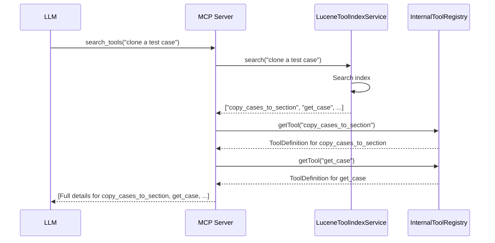
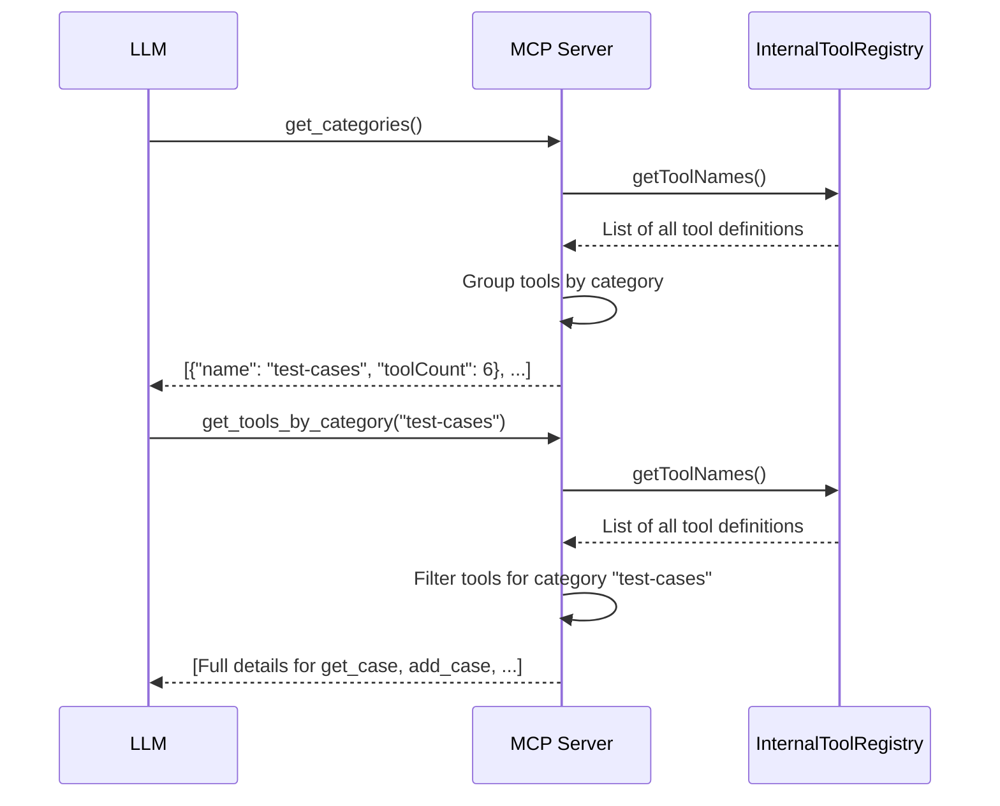
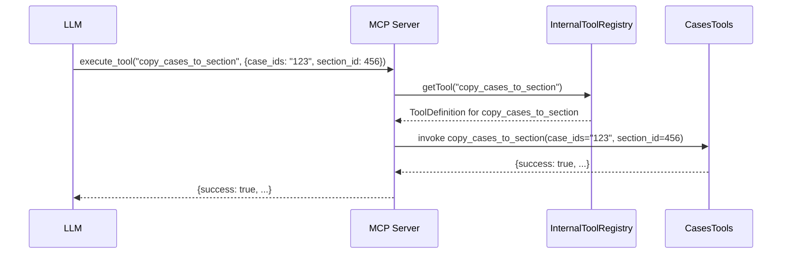

# Tools Reference

This document provides a complete reference for all 101 internal tools available in the TestRail MCP Server. These tools are not directly exposed to the LLM; instead, they are discovered and executed via the `search_tools` and `execute_tool` gateway.

## Tool Discovery and Execution

The TestRail MCP Server exposes a 4-tool gateway to the LLM, providing two distinct paths for discovering the 101 internal tools:

-   **Search Path**
    -   `search_tools(query: string)`: Fuzzy-searches all 101 internal tools and returns a ranked list of matches.
-   **Browse Path**
    -   `get_categories()`: Returns a list of all 19 tool categories (e.g., `test-cases`, `projects`).
    -   `get_tools_by_category(category: string)`: Returns all tools in a specific category.
-   **Execution**
    -   `execute_tool(toolName: string, parameters: map)`: Executes a specific internal tool by name.

This architecture allows the LLM to discover the right tool for the job without being overwhelmed by the full list of 101 tools, supporting both directed searching and open-ended exploration.

### Search-Based Discovery Flow

### Browse-Based Discovery Flow

### Tool Execution Flow

## Tool Categories

-   **Attachments**: Tools for managing attachments on TestRail entities.
-   **BDDs**: Tools for managing BDD scenarios.
-   **Case Fields**: Tools for managing custom fields for test cases.
-   **Case Types**: Tools for managing test case types.
-   **Cases**: Tools for managing test cases.
-   **Configurations**: Tools for managing test configurations.
-   **Datasets**: Tools for managing test datasets.
-   **Groups**: Tools for managing user groups.
-   **Labels**: Tools for managing labels.
-   **Milestones**: Tools for managing milestones.
-   **Plans**: Tools for managing test plans.
-   **Priorities**: Tools for managing priorities.
-   **Projects**: Tools for managing projects.
-   **Reports**: Tools for managing reports.
-   **Result Fields**: Tools for managing custom fields for test results.
-   **Results**: Tools for managing test results.
-   **Roles**: Tools for managing user roles.
-   **Runs**: Tools for managing test runs.
-   **Sections**: Tools for managing sections within test suites.
-   **Shared Steps**: Tools for managing shared steps.
-   **Statuses**: Tools for managing test statuses.
-   **Suites**: Tools for managing test suites.
-   **Templates**: Tools for managing project templates.
-   **Tests**: Tools for managing tests within a test run.
-   **Users**: Tools for managing users.
-   **Variables**: Tools for managing test variables.

## Complete Tool List

*(A complete, auto-generated list of all 101 tools with their parameters and descriptions will be added here in a future update.)*
