# Tools Reference Documentation

Complete reference for all 26 MCP tools provided by the TestRail MCP Server.

## Table of Contents

- [Overview](#overview)
- [Tool Categories](#tool-categories)
- [Cases Tools](#cases-tools)
- [Projects Tools](#projects-tools)
- [Runs Tools](#runs-tools)
- [Results Tools](#results-tools)
- [Sections Tools](#sections-tools)
- [Tool Metadata Schema](#tool-metadata-schema)
- [Error Handling](#error-handling)

---

## Overview

### Tool Distribution

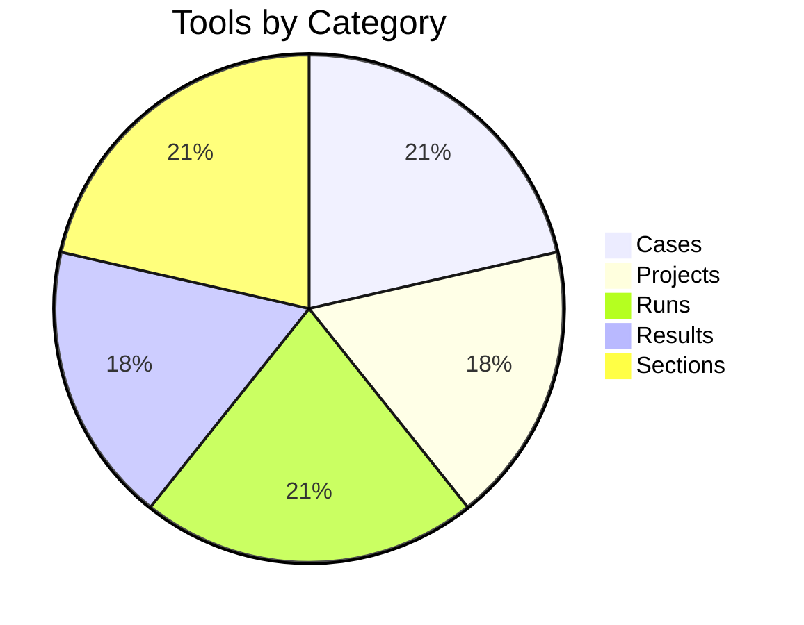

### Tool Characteristics

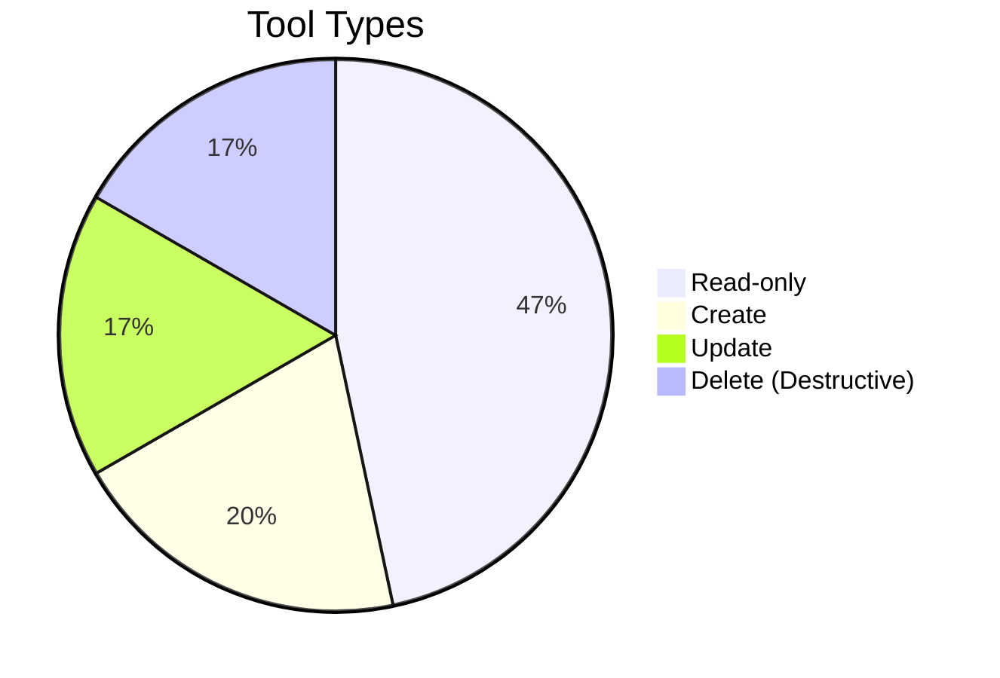

### Tool Decision Flow

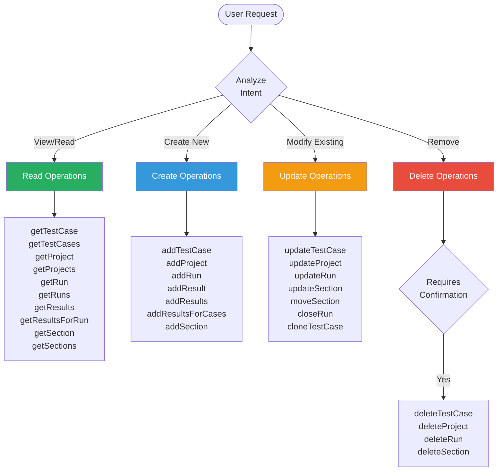

---

## Tool Categories

```mermaid
flowchart LR
    subgraph Cases["Test Cases"]
        direction TB
        C1[getTestCase]
        C2[getTestCases]
        C3[addTestCase]
        C4[updateTestCase]
        C5[deleteTestCase]
        C6[cloneTestCase]
    end

    subgraph Projects["Projects"]
        direction TB
        P1[getProject]
        P2[getProjects]
        P3[addProject]
        P4[updateProject]
        P5[deleteProject]
    end

    subgraph Runs["Test Runs"]
        direction TB
        R1[getRun]
        R2[getRuns]
        R3[addRun]
        R4[updateRun]
        R5[closeRun]
        R6[deleteRun]
    end

    subgraph Results["Test Results"]
        direction TB
        RS1[getResults]
        RS2[getResultsForRun]
        RS3[addResult]
        RS4[addResults]
        RS5[addResultsForCases]
    end

    subgraph Sections["Sections"]
        direction TB
        S1[getSection]
        S2[getSections]
        S3[addSection]
        S4[updateSection]
        S5[deleteSection]
        S6[moveSection]
    end

    Cases ~~~ Projects
    Projects ~~~ Runs
    Runs ~~~ Results
    Results ~~~ Sections

    style Cases fill:#3498db,color:#fff
    style Projects fill:#9b59b6,color:#fff
    style Runs fill:#27ae60,color:#fff
    style Results fill:#f39c12,color:#fff
    style Sections fill:#e74c3c,color:#fff
```

---

## Cases Tools

### Tool Relationship Map

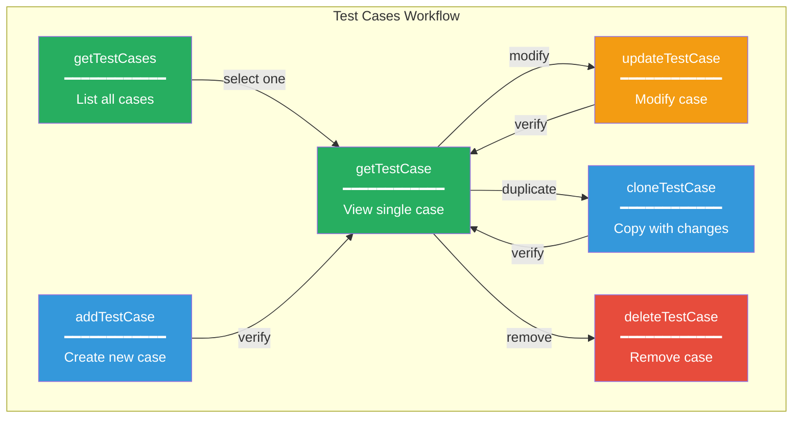

### getTestCase

Retrieves a specific test case by ID.

| Property | Value |
|----------|-------|
| **Category** | Cases |
| **Destructive** | No |
| **Requires Confirmation** | No |

**Parameters:**

| Name | Type | Required | Description |
|------|------|----------|-------------|
| `caseId` | Integer | Yes | Test case ID (with or without 'C' prefix) |

**Returns:** `TestCase` object with all fields

**Example Prompts:**
- "Show me test case C123"
- "Get the details of case 456"
- "What are the steps in test case C789?"

**Might Lead To:**
- `updateTestCase` - to modify the case
- `cloneTestCase` - to copy with changes
- `deleteTestCase` - to remove the case

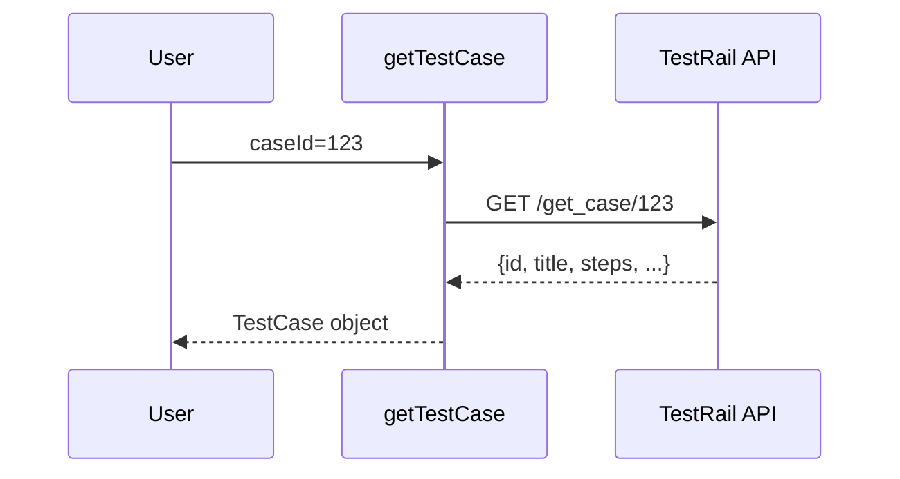

---

### getTestCases

Retrieves test cases for a project with pagination.

| Property | Value |
|----------|-------|
| **Category** | Cases |
| **Destructive** | No |
| **Requires Confirmation** | No |

**Parameters:**

| Name | Type | Required | Description |
|------|------|----------|-------------|
| `projectId` | Integer | Yes | Project ID |
| `suiteId` | Integer | No | Suite ID (for multi-suite projects) |
| `sectionId` | Integer | No | Filter by section |
| `limit` | Integer | No | Max results (1-250, default 250) |
| `offset` | Integer | No | Pagination offset |

**Returns:** `List<TestCase>`

**Example Prompts:**
- "List all test cases in project 1"
- "Show me test cases in suite 5"
- "Get cases from section 10 in project 3"

**Pagination Example:**

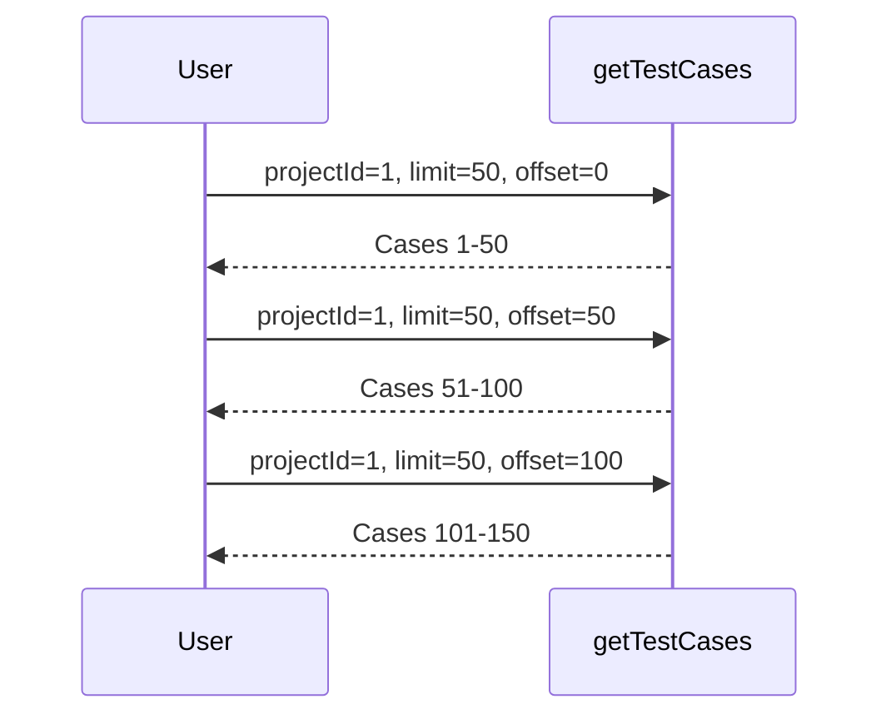

---

### addTestCase

Creates a new test case in a section.

| Property | Value |
|----------|-------|
| **Category** | Cases |
| **Destructive** | No |
| **Requires Confirmation** | Yes |

**Parameters:**

| Name | Type | Required | Description |
|------|------|----------|-------------|
| `sectionId` | Integer | Yes | Target section ID |
| `title` | String | Yes | Test case title |
| `steps` | String | No | Test steps |
| `expectedResult` | String | No | Expected outcome |
| `preconditions` | String | No | Prerequisites |
| `priorityId` | Integer | No | 1=Low, 2=Medium, 3=High, 4=Critical |
| `typeId` | Integer | No | Test type ID |
| `refs` | String | No | References (e.g., "JIRA-123") |

**Returns:** Created `TestCase` object

**Example Prompts:**
- "Create a new test case for login validation"
- "Add a test case to section 5 for password reset"

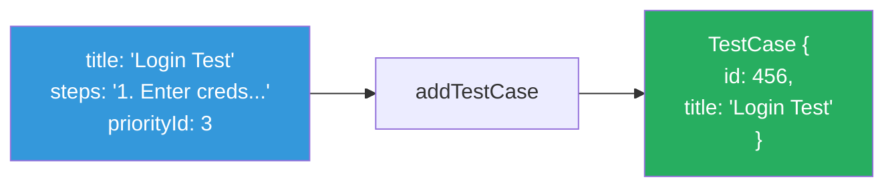

---

### updateTestCase

Updates an existing test case.

| Property | Value |
|----------|-------|
| **Category** | Cases |
| **Destructive** | No |
| **Requires Confirmation** | Yes |

**Parameters:**

| Name | Type | Required | Description |
|------|------|----------|-------------|
| `caseId` | Integer | Yes | Case ID to update |
| `title` | String | No | New title |
| `steps` | String | No | New steps |
| `expectedResult` | String | No | New expected result |
| `preconditions` | String | No | New preconditions |
| `priorityId` | Integer | No | New priority |
| `typeId` | Integer | No | New type |
| `refs` | String | No | New references |

**Note:** Only provided fields are updated; others remain unchanged.

**Returns:** Updated `TestCase` object

---

### deleteTestCase

Permanently deletes a test case.

| Property | Value |
|----------|-------|
| **Category** | Cases |
| **Destructive** | **YES** |
| **Requires Confirmation** | Yes |

**Parameters:**

| Name | Type | Required | Description |
|------|------|----------|-------------|
| `caseId` | Integer | Yes | Case ID to delete |

**Returns:** `OperationResult` with success message

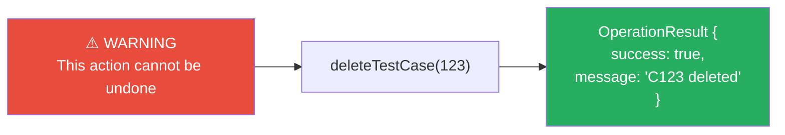

---

### cloneTestCase

Creates a copy of an existing test case with optional modifications.

| Property | Value |
|----------|-------|
| **Category** | Cases |
| **Destructive** | No |
| **Requires Confirmation** | Yes |

**Parameters:**

| Name | Type | Required | Description |
|------|------|----------|-------------|
| `sourceCaseId` | Integer | Yes | Case ID to clone |
| `targetSectionId` | Integer | No | Destination section (default: same) |
| `newTitle` | String | No | New title (default: "Copy of...") |
| `newSteps` | String | No | Modified steps |
| `newExpectedResult` | String | No | Modified expected result |

**Returns:** Newly created `TestCase` object

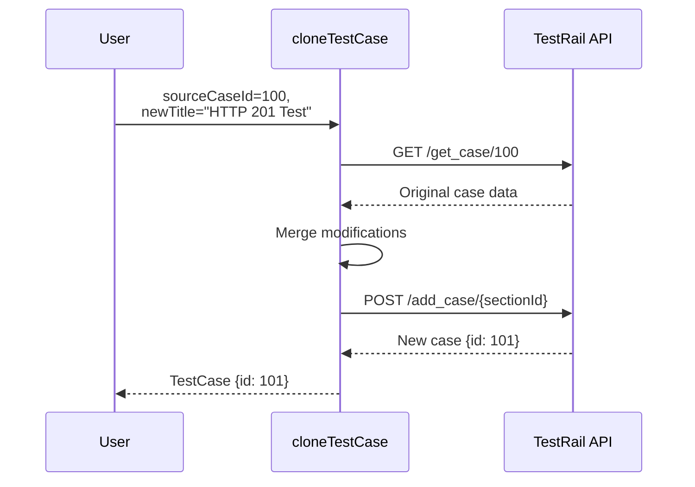

---

## Projects Tools

### Tool Relationship Map

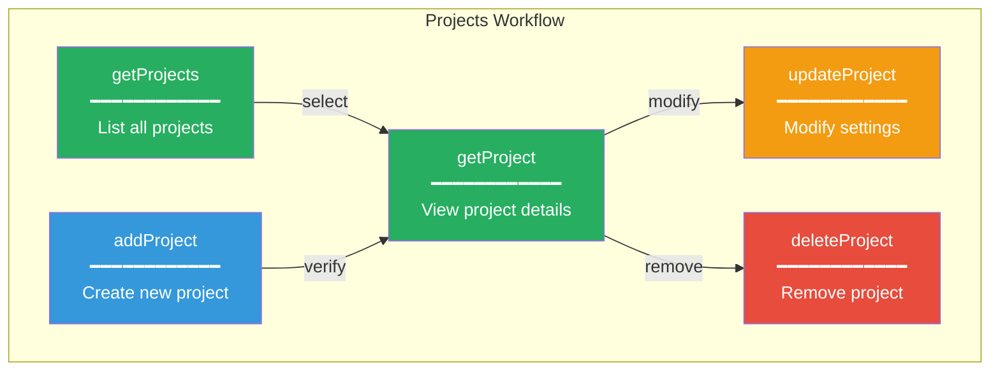

### getProject

| Property | Value |
|----------|-------|
| **Destructive** | No |
| **Requires Confirmation** | No |

**Parameters:**

| Name | Type | Required | Description |
|------|------|----------|-------------|
| `projectId` | Integer | Yes | Project ID |

---

### getProjects

| Property | Value |
|----------|-------|
| **Destructive** | No |
| **Requires Confirmation** | No |

**Parameters:** None

**Returns:** `List<Project>` - All accessible projects

---

### addProject

| Property | Value |
|----------|-------|
| **Destructive** | No |
| **Requires Confirmation** | Yes |

**Parameters:**

| Name | Type | Required | Description |
|------|------|----------|-------------|
| `name` | String | Yes | Project name |
| `announcement` | String | No | Announcement text |
| `showAnnouncement` | Boolean | No | Show announcement |
| `suiteMode` | Integer | No | 1=Single, 2=Baselines, 3=Multiple |

---

### updateProject

| Property | Value |
|----------|-------|
| **Destructive** | No |
| **Requires Confirmation** | Yes |

**Parameters:**

| Name | Type | Required | Description |
|------|------|----------|-------------|
| `projectId` | Integer | Yes | Project ID |
| `name` | String | No | New name |
| `announcement` | String | No | New announcement |
| `showAnnouncement` | Boolean | No | Show announcement |
| `isCompleted` | Boolean | No | Mark as completed |

---

### deleteProject

| Property | Value |
|----------|-------|
| **Destructive** | **YES** |
| **Requires Confirmation** | Yes |

**Parameters:**

| Name | Type | Required | Description |
|------|------|----------|-------------|
| `projectId` | Integer | Yes | Project ID to delete |

**Warning:** Deletes ALL test suites, cases, runs, and results!

---

## Runs Tools

### Tool Relationship Map

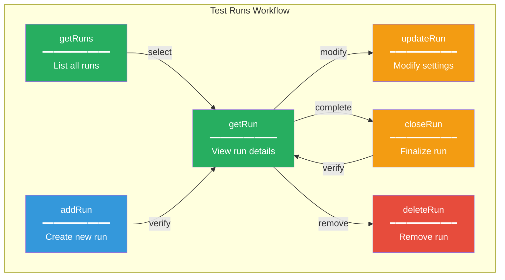

### addRun

| Property | Value |
|----------|-------|
| **Destructive** | No |
| **Requires Confirmation** | Yes |

**Parameters:**

| Name | Type | Required | Description |
|------|------|----------|-------------|
| `projectId` | Integer | Yes | Project ID |
| `name` | String | Yes | Run name |
| `description` | String | No | Run description |
| `suiteId` | Integer | No | Suite ID |
| `milestoneId` | Integer | No | Milestone ID |
| `assignedtoId` | Integer | No | Assigned user ID |
| `includeAll` | Boolean | No | Include all cases (default: true) |
| `caseIds` | String | No | Comma-separated case IDs |

---

### closeRun

| Property | Value |
|----------|-------|
| **Destructive** | No |
| **Requires Confirmation** | Yes |

**Parameters:**

| Name | Type | Required | Description |
|------|------|----------|-------------|
| `runId` | Integer | Yes | Run ID to close |

**Note:** Once closed, no more results can be added.

---

## Results Tools

### Tool Relationship Map

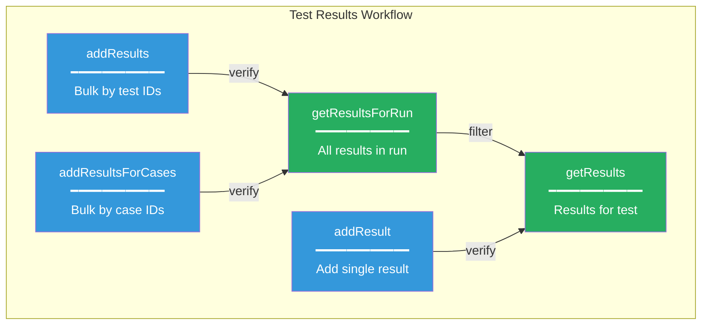

### Status IDs Reference

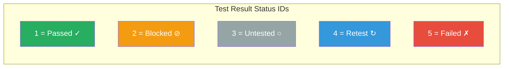

### addResult

| Property | Value |
|----------|-------|
| **Destructive** | No |
| **Requires Confirmation** | Yes |

**Parameters:**

| Name | Type | Required | Description |
|------|------|----------|-------------|
| `testId` | Integer | Yes | Test ID (not case ID) |
| `statusId` | Integer | Yes | 1=Passed, 2=Blocked, 3=Untested, 4=Retest, 5=Failed |
| `comment` | String | No | Execution notes |
| `defects` | String | No | Defect references |
| `elapsed` | String | No | Time spent (e.g., "30s", "1m 45s") |
| `version` | String | No | Build version |

---

## Sections Tools

### Tool Relationship Map

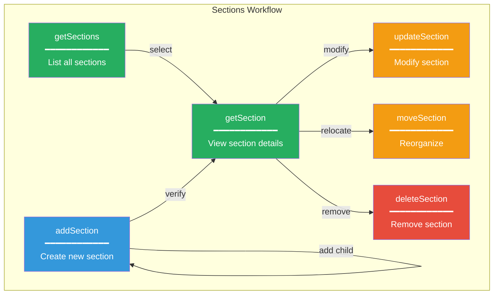

### Section Hierarchy Example

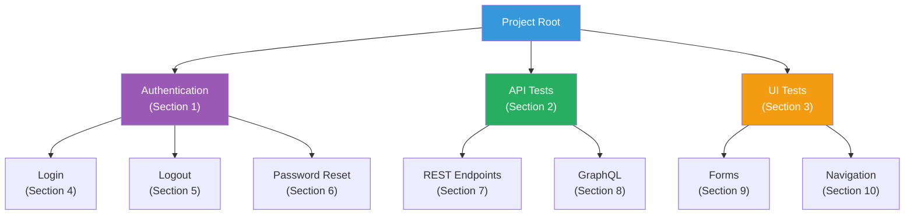

---

## Tool Metadata Schema

Each tool includes rich metadata for LLM understanding:

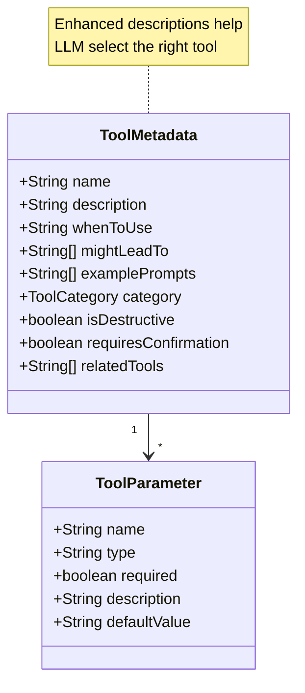

---

## Error Handling

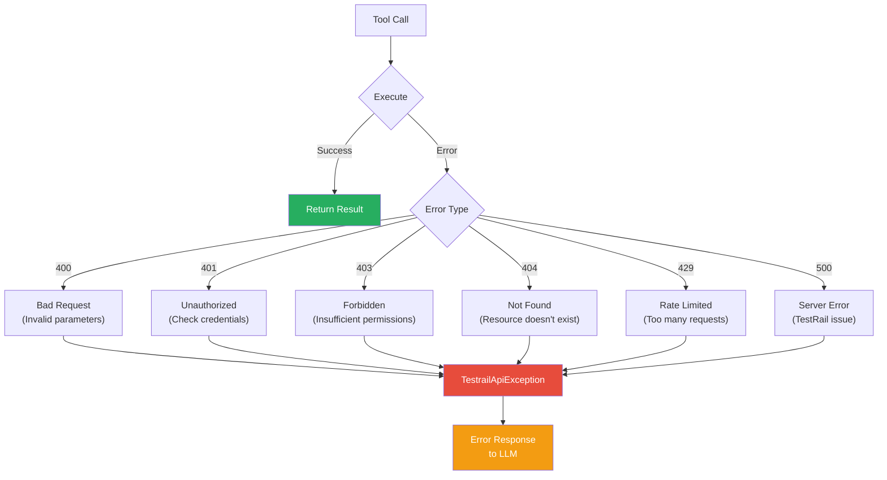
